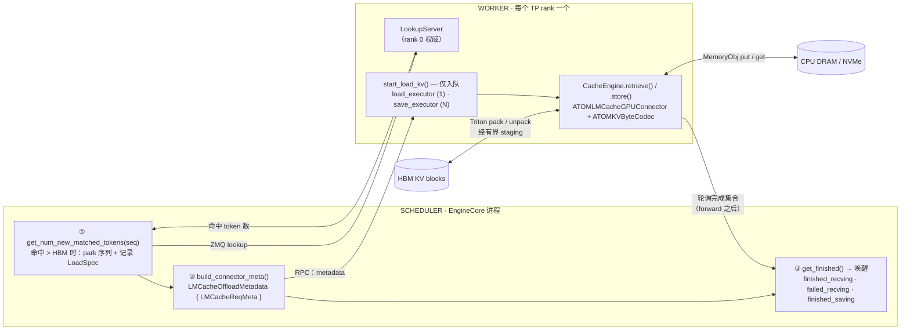
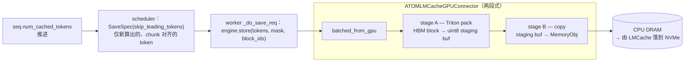
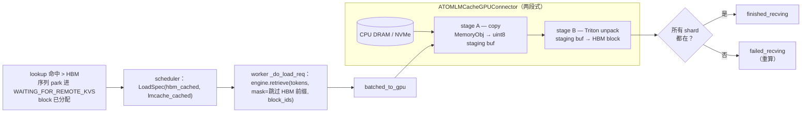
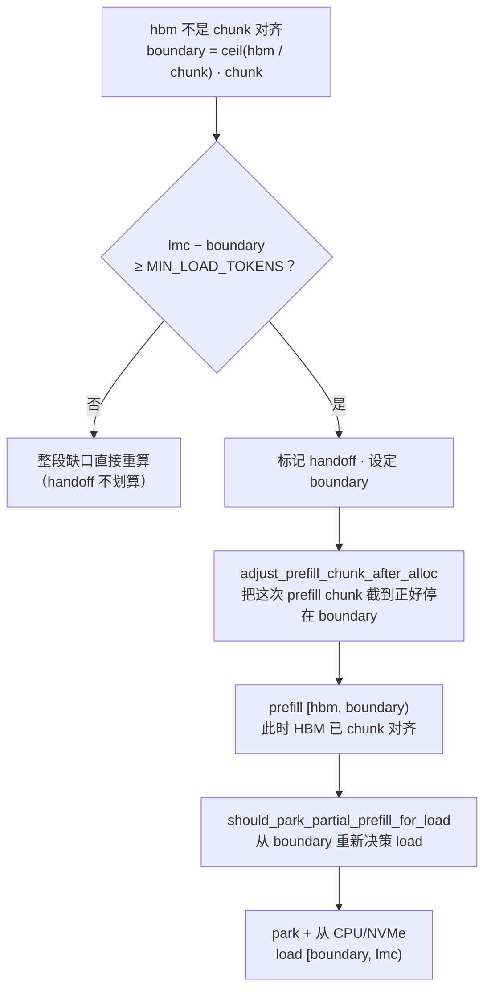

# LMCache CPU/NVMe KV Cache 卸载（ATOM 独立路径）

> 本文是 [`README.md`](./README.md) 的中文译版，内容以英文版为准。

本模块在 ATOM 原生 HBM prefix cache 之上，新增一层 **CPU DRAM（L2）以及可选的
NVMe（L3）KV-cache 存储层**。当一个请求的 prompt 前缀已经被挤出 HBM、但仍存在于
CPU/NVMe 中时，connector 会**重新加载（reload）**这些 KV block，而不是重算
（recompute）—— 把一次完整 prefill 变成一次 host→GPU 拷贝。这能为前缀复用密集型
负载（多轮 agentic 服务、超长共享 system prompt）提升有效缓存命中率与并发度。

这是 **ATOM 原生、引擎内（in-engine）** 的卸载路径：connector 通过共享的
[`KVConnectorFactory`](../disaggregation/factory.py) 直接挂进 ATOM 的
scheduler/worker，**全程不经过 vLLM**。若需 **vLLM 插件** 卸载路径（LMCache 经由
vLLM 自己的 connector API 驱动），以及两条路径都需要的「LMCache ROCm 源码编译」
步骤，见
[`recipes/atom_vllm/LMCache-KV-Cache-Offload.md`](../../../recipes/atom_vllm/LMCache-KV-Cache-Offload.md)。

第一次读这个模块？建议从上往下读：前面的章节给全局图景；字节级的深挖
（[重点模块详解](#重点模块详解)、[与 LMCache 的关系](#与-lmcache-的关系复用-vs-覆盖)）
放在后面。不熟悉的术语见[术语表](#术语表)。

## 设计概览

整个模块由两个核心想法支撑：

1. **LMCache 负责存储层；ATOM 负责 GPU 布局。**
   我们驱动 LMCache 的 `CacheEngine.store()` / `CacheEngine.retrieve()`，让
   LMCache 继续做它擅长的事 —— 分块（256-token chunk）、key 生成、lookup pin、
   CPU/NVMe storage-manager 的 put/get、淘汰（eviction）。但 LMCache 自带的 GPU
   connector 只能表达 **token-major** 的 KV（`KV_2LTD` 等）。而 ATOM 的 AITER
   attention 把 K 存成 **x-packed + head-major**（`K=(nb,H,D//x,bs,x)`，
   `x = 16 // elem`）、把 V 存成 strided（`nb,H,D,bs`）。因此我们给 LMCache 传入一个
   ATOM 自有的 `GPUConnectorInterface` 实现，它搬运的是 **逐 block 的不透明字节**
   （`ATOMKVByteCodec`）—— 一次字节级完全一致（byte-identical）的往返，attention
   kernel 读回的就是它自己的布局。LMCache 完全不需要理解这个布局。

2. **拷贝跑在 RPC 线程之外，且在 `forward` 之后。**
   `start_load_kv` 只把任务 `submit` 给拷贝 daemon 然后立即返回，因此 worker 的 RPC
   线程始终空出来跑 `forward`。完成情况在 `forward` 之后由 `get_finished` 轮询。
   这就是对经典「加载 KV block 会饿死正在跑的 prefill」耦合问题的修复。

## 模块文件一览

| 文件 | 职责 |
|------|------|
| `__init__.py` | 把 `lmcache_offload` 后端注册进 `KVConnectorFactory`。 |
| `connector.py` | 两个半边：`LMCacheOffloadConnectorScheduler`（EngineCore 进程）与 `LMCacheOffloadConnector`（worker）。核心编排逻辑。 |
| `config.py` | 从 `LMCACHE_*` 环境变量和 `kv_transfer_config` extras 构建每个 rank 的 `LMCacheEngineConfig` + `LMCacheMetadata`。 |
| `metadata.py` | `ATOMRawBytesLMCacheMetadata`（不透明 uint8 分配）+ 逐请求的传输描述符（`LoadSpec`、`SaveSpec`、`LMCacheReqMeta`、`LMCacheOffloadMetadata`）。 |
| `atom_kv_byte_codec.py` | `ATOMKVByteCodec`：把 token 区间映射到 AITER KV block，并按原始字节 pack/unpack。布局桥接的核心。 |
| `atom_lmcache_gpu_connector.py` | `ATOMLMCacheGPUConnector`：LMCache `GPUConnectorInterface` 的实现。有界 GPU staging + 两段式（pack ↔ copy）流水线。 |
| `atom_lmcache_staging.py` | 每线程的 CUDA stream、staging buffer、ready/free event、环境变量辅助函数。 |
| `triton_kv_staging.py` | Triton fused chunk-major pack/unpack kernel（快速 staging 路径）。 |

## 架构

connector 拆分到两个进程，与 ATOM 的 P/D 拆分一致：



### Scheduler 侧（`LMCacheOffloadConnectorScheduler`）

运行在 EngineCore 进程。它只决定**搬什么**，绝不碰 GPU 内存。

- **`get_num_new_matched_tokens(seq)`** —— 新请求到来时，通过 ZMQ 向 worker 的
  `LookupServer` 查询 LMCache 持有多少 prompt token。若命中数超过 HBM 已有的，就
  记录一个 `LoadSpec` 并返回 `(need, True)`，把该序列 **park** 进
  `WAITING_FOR_REMOTE_KVS`。
- **`update_state_after_alloc` / `should_park_for_load_after_alloc`** —— block 分配
  之后，重新读取**真实**的 HBM 命中数（lookup 发生在 HBM prefix 匹配之前，所以当时
  记录的 `num_cached_tokens` 是过期的）。只加载缺口 `[hbm_cached, lmcache_hit)`，且
  必须 chunk 对齐、并越过 `OFFLOAD_MIN_LOAD_TOKENS` 门槛。加载到 HBM floor 以下会
  覆盖共享的 prefix-cache block → 输出损坏，所以这条下限是硬的。
- **`build_connector_meta()`** —— 为每个 load/save 生成一个 `LMCacheReqMeta`，放进
  `LMCacheOffloadMetadata`，作为每个 step 转发给 worker 的快照。save 走一个持久的
  `_save_tracker`，随着已计算前沿（`num_cached_tokens`）推进，把新算出的 prompt
  chunk 逐块存下去。
- **save/free 协调** —— `should_defer_free` 会扣住 block 直到其 in-flight save 落
  地；`save_finished` / `load_failed` 负责对账（一次失败的 load 会下调 save floor，
  让被重算的 chunk 重新被持久化）。

### Worker 侧（`LMCacheOffloadConnector`）

运行在每个 TP-rank worker 上。它做真正的字节搬运。

- **`register_kv_caches`** —— 在已注册的 KV tensor 上构建 `ATOMKVByteCodec`、
  LMCache engine，以及（仅 rank 0）`LookupServer`。
- **`start_load_kv(metadata)`** —— *仅入队*。对每个请求，把 load `submit` 给
  `_load_executor` 和/或把 save `submit` 给 `_save_executor`，然后返回。**RPC 线程
  上不发生任何拷贝。**
- **`_do_load_req` / `_do_save_req`** —— 跑在 daemon 线程上。调用
  `engine.retrieve()` / `engine.store()`，经由 ATOM GPU connector。load 按 shard 是
  全有或全无（all-or-nothing）：任一 shard 缺失则该 load 失败，scheduler 转去重算。
- **`get_finished()`** —— 在 forward 之后轮询；返回完成集合，scheduler 据此做唤醒
  （见下文协议）。

## 请求生命周期

跟着一个请求从头走到尾，能把各部分串起来：

1. **Lookup。** 新请求到来；scheduler 的 `get_num_new_matched_tokens` 通过 ZMQ 问
   rank-0 `LookupServer`：LMCache 持有多少 prompt token。若命中超过 HBM prefix
   cache，就记录 `LoadSpec` 并把序列 **park** 进 `WAITING_FOR_REMOTE_KVS`。
2. **决策。** block 分配后，`_decide_load_after_alloc` 重新核对**真实** HBM floor，
   在 load 与 recompute 间二选一（见
   [reload 究竟何时发生？](#reload-究竟何时发生)）。
3. **入队。** `build_connector_meta` 生成一个 `LMCacheReqMeta`；worker 的
   `start_load_kv` 把 load 提交给 load daemon 后立即返回 —— RPC 线程空出来跑
   `forward`。
4. **搬运。** daemon 跑 `engine.retrieve`，驱动 `ATOMLMCacheGPUConnector`：MemoryObj
   → staging buffer → HBM block（Triton unpack），字节级一致。
5. **唤醒。** forward 之后，`get_finished` 返回 `finished_recving`（成功）或
   `failed_recving`（重算）。scheduler 唤醒序列，它只 prefill 尚未缓存的**后缀
   （suffix）**。
6. **保存。** 随着 prefill 算出新 chunk，scheduler 发出 save；save daemon 把它们
   fire-and-forget 存到 CPU/NVMe。被延迟 free 的 block 在 `finished_saving` 时释放。

## 完成协议（Completion Protocol）

卸载扩展了 P/D 的完成状态。这套映射是正确性的关键 —— 注意它与 P/D producer 之间
刻意为之的不对称：

| Worker 集合 | Scheduler 的动作 |
|------------|------------------|
| `finished_recving` | load 成功 → 唤醒被 park 的序列并运行它。 |
| `failed_recving`   | load 失败 → 唤醒序列，用其**已分配**的 block 去**重算**。 |
| `finished_saving`  | fire-and-forget 的 save 落地 → 释放此前被延迟 free 的 block。 |
| `finished_sending` | **从不使用。** P/D producer 上报这个状态时 scheduler 会*释放* block —— 那会把存活的卸载 block 误删。因此 `is_producer = False`。 |

scheduler 上的 `is_offload = True` 让它走「卸载唤醒」（suffix prefill），而不是
`Scheduler.schedule()` 里的 P/D decode-jump。

## Save / Load 数据流

**Save（HBM → CPU/NVMe），在某个 prefill chunk 算完后 fire-and-forget：**



**Load（CPU/NVMe → HBM），处于 TTFT 关键路径上：**



GPU connector 使用**有界**的 staging buffer（`OFFLOAD_GPU_STAGING_CHUNKS` 个
chunk，默认 2）和两段式流水线：当一组在 host↔staging 之间拷贝时，下一组在另一条
CUDA stream 上做 pack/unpack，两者通过 ready/free event 交接。超过 buffer 容量的
传输会被切成多组，因此无论前缀多长，HBM staging 开销都有上限。

**`OFFLOAD_GPU_STAGING_CHUNKS` 定的是*每一块* staging buffer 的大小，而 buffer 不止
一块。** buffer 是线程局部的（`threading.local`），而 load 和 save 跑在**分开的
executor** 上（见 worker 侧）。因此 **load 路径**独占一块 staging buffer，**save 路径**
每个 save worker 各一块 —— 两者从不共享。所以常驻 staging HBM 是:

```
staging_chunk_bytes = (LMCACHE_CHUNK_SIZE / block_size) * bytes_per_block
per_buffer_bytes    = OFFLOAD_GPU_STAGING_CHUNKS * staging_chunk_bytes
resident_HBM        ≈ (1 个 load + OFFLOAD_COPY_WORKERS 个 save) * per_buffer_bytes
```

chunk2 那次就是 `2 * 16.76 MiB ≈ 33.5 MiB`/块 ×（1 load + 1 save）≈ **67 MiB** 总量。
调大 `OFFLOAD_GPU_STAGING_CHUNKS` 能加速传输，但会让**两块** buffer 同时变大。

## reload 究竟何时发生？

一次 lookup 命中**并不**保证会 reload。block 分配之后，`_decide_load_after_alloc`
会重新核对**真实**的 HBM 命中数，并从下面的结果里挑一个。所有量都按 LMCache chunk
（256 token）量化 —— KV 只会在 chunk 边界上被 load/save，因为那才是一个 LMCache key
的粒度。

| 情形（`hbm` = HBM 命中，`lmc` = lookup 命中，`chunk` = 256） | 结果 |
|---|---|
| `lmc <= hbm` | `hbm_satisfies_after_alloc` —— HBM 已覆盖命中；**不 load**。 |
| `hbm` 不是 `chunk` 的整数倍 | `unaligned_hbm_prefill` —— 走 **handoff**（始终生效，见下文）：先重算补齐到 chunk 边界，再 load 其余。 |
| `lmc - hbm < OFFLOAD_MIN_LOAD_TOKENS`（默认 8192） | `too_small` —— reload 不如跳过；**重算**。 |
| `hbm` 对齐**且**缺口足够大 | `aligned_large_hit` —— 从 CPU/NVMe **load** `[hbm, lmc)`。 |

表格背后有两条硬规则：

- **绝不加载到 HBM floor 以下。** lookup 跑在 HBM prefix 匹配*之前*，所以记录下的
  `hbm_cached_tokens` 是过期的（常常是 0）。我们始终以分配后的 `num_cached_tokens`
  作为下限来 reload —— 在它之下加载会覆盖可能被其它序列共享的 prefix-cache block，
  污染它们的输出。
- **worker 也会再校验一次对齐。** 如果一个 load 请求仍带着不对齐的 HBM 前缀到达，
  `_do_load_req` 会拒绝它（`failed_recving` → 重算），而不是写入一个错位的 chunk。

### HBM 不对齐：先 prefill 到 chunk 边界，再 load

当 HBM 前缀*不是* chunk 对齐时，缺口 `[hbm, lmc)` 无法直接加载（某个 chunk 会跨越
边界）。connector **始终**做 handoff（已移除 `OFFLOAD_UNALIGNED_HANDOFF` 开关，现在无条件生效）
—— **先算出到下一个 chunk 边界的那一小段，再把剩下的 reload 回来：**



因此 handoff 把请求拆成两段：一小段为达到对齐而重算（≤ 一个 chunk），随后是一大段
reload —— 仅当越过边界后的剩余量仍能越过 `OFFLOAD_MIN_LOAD_TOKENS` 时才采用，否则
直接重算更划算。

### Save 的对齐

出于同样的原因，save 永远 chunk 对齐。随着 prefill 算出各个 chunk，scheduler 把每一
段新算完、chunk 对齐的区间存下去（`SaveSpec.skip_leading_tokens` 向下取整到
`chunk`）。prompt 的**不对齐尾巴**只在请求的最后一次 prefill step
（`is_last_prefill`）才存，所以一个不完整的尾 chunk 绝不会在 prefill 中途被持久化。

## 正确性、fp8 与失败处理

KV 卸载容错极低 —— 一个字节放错位置就会无声地污染模型输出。本设计依赖几条硬性
不变量来兜底。

### 字节级一致往返

codec 搬运的是**不透明字节**，从不重新解释数值，因此一个 block 写到 CPU/NVMe 再读
回来，与 attention kernel 写入的逐位一致。正是这一点让我们可以完全绕开 LMCache 对
布局的假设。该往返（含下面的 fp8 路径）在
`tests/test_lmcache_offload_connector.py` 中被验证为字节级一致。

### fp8 KV 与 per-block scale

在 `--kv_cache_dtype fp8` 下，每个 KV block 自带 `k_scale` / `v_scale`。
`ATOMKVByteCodec` 在存在时为每层枚举**四个** segment —— `k_cache`、`v_cache`、
`k_scale`、`v_scale` —— 并把它们都作为一个 block 字节的一部分一起搬运
（`atom_kv_byte_codec.py`）。scale 与量化数据同行，因此 reload 回来的 fp8 block
反量化结果完全一致；不存在任何 scale 被重算或丢弃。

### 代码中强制的不变量

| 不变量 | 位置 | 原因 |
|-----------|-------|-----|
| `chunk_size % block_size == 0` | `metadata.py`、`atom_lmcache_gpu_connector.py` 构造函数 | 一个 LMCache chunk 必须映射到整数个 ATOM block，否则 chunk 会跨越 block 边界。 |
| 绝不加载到 HBM floor 以下 | scheduler `_decide_load_after_alloc` | 在 `num_cached_tokens` 之下加载会覆盖与其它序列共享的 prefix-cache block → 损坏。 |
| load 按 shard 全有或全无 | worker `_do_load_req` | 半加载的前缀比不加载更糟；任一 shard 缺失则整个 load 失败 → 重算。 |
| 仅 chunk 对齐的 load/save | scheduler + worker | LMCache key 以 chunk 为单位；不对齐的写入没有合法 key。 |

### 失败处理

每一种失败都退化为「放弃这次卸载机会」，绝不会卡死或写坏：

- **save 失败** —— `_guard` 把请求标记为 `done_save`（而不是让它的 block 永久被
  pin）；该请求这次单纯没被持久化。
- **load 失败 / miss** —— worker 上报 `failed_recving`；scheduler 唤醒序列，用其
  **已分配**的 block 去**重算**，并由 `load_failed` 下调 save floor，让被重算的
  `[hbm, lmc)` chunk 重新被存，而不是被当成已持久化。
- **请求在 save 中途 abort** —— `should_defer_free` 扣住 block 直到 in-flight save
  落地（`finished_saving`），因此 save 绝不会读到已释放的内存。
- **lookup server 不可用** —— `register_kv_caches` 打一条 warning 并以 save-only
  运行；load 不再被提供（lookup 返回无命中）。

## TP > 1 注意事项

- **lookup 以 rank 0 为权威**（`cfg.lookup_server_worker_ids = [0]`）。connector 在
  **所有** rank 上同步（lockstep）地 save，因此 rank 0 对「是否已卸载」的回答对整个
  组都正确；之后每个 rank 各自加载自己的 KV shard。没有这条，客户端会对各 rank 的
  lookup 取 `min()`，只要有一个 rank 返回 0 就会让 scheduler 永远重算。
- **load 全有或全无。** 只要任一 rank 的 shard 缺失，`_do_load_req` 就上报
  `failed_recving`，scheduler 转去重算 —— 不存在加载到一半的中间状态。

## 重点模块详解

`connector.py`（scheduler/worker 编排）在 [架构](#架构) 一节已详述。本节深入讲
**字节搬运栈** —— 让 ATOM 的 KV 布局能和 LMCache 协作的那部分 —— 以及两个支撑文件。

### `atom_kv_byte_codec.py` —— 布局桥接

整个方案的基石。两边的 KV 布局互不兼容:

**LMCache 期望的 —— token-major。** 它的 GPU connector 只接受干净的 NHD/HND 族
（`KV_2LTD` 等），即 KV 大致按 `[layer, k/v, token, head, head_dim]` 索引，先在
`head_dim` 再在 token 上连续。`normalize_kv_and_discover_format` 会拒绝其它任何布局。

**AITER 实际存的 —— x-packed、head-major、分页（paged）。** 每层如下
（`bs` = block size，`H` = 本 rank KV head 数，`D` = head dim，`x = 16 // elem_bytes`，
即 fp8 时 `x=16` / bf16 时 `x=8`）:

| Tensor | Shape | 说明 |
|--------|-------|------|
| `k_cache` | `(num_blocks, H, D//x, bs, x)` | head-major；`D` 拆成 `D//x` 外层 × `x` 内层，中间夹着 `bs` → 不是 token 连续 |
| `v_cache` | `(num_blocks, H, …, bs, …)` | strided、head-major（具体拆法因模型而异） |
| `k_scale`、`v_scale`（fp8） | `(num_blocks, H, bs)` | 一个 block 内每 (head, token) 一个 fp32 scale |

这是**持久 HBM 存储布局**（不是临时的 LDS bank "swizzle"），且只属于这条 ATOM AITER
路径 —— stock vLLM 的 `rocm_aiter_fa` 用的是干净的 token-major `(2,nb,bs,H,D)`，LMCache
原生就能处理。

**桥接怎么做 —— 不透明字节的 gather/scatter，不转码。** codec 从不重新解释数值。上面
任一 tensor 的一整个 *block*（`tensor[block_id]`）在内存里是连续的，所以一个 block 的
KV 就是几段连续字节切片（每层:K、V、以及 fp8 scale）。codec 把一个 LMCache chunk 的
若干 block gather 进一个 **chunk-major `uint8`** buffer ——
`[chunk: seg0 blocks | seg1 blocks | …]` —— LMCache 把它当作不透明 blob 存下；reload 时
再把那些字节 scatter 回原来的 block 槽位。唯一的变换是*哪些字节落到哪*（把分页 block
gather 成连续的 chunk 顺序），从不改动 bit pattern —— 所以往返字节级一致，AITER kernel
读回的就是它的原生布局。LMCache 自始至终只看到一个按 chunk 为 key 的 `uint8` 数组，完全
不需要知道 `x`、head 或分页。

**三个让后文精确的术语:**

- **segment** —— 一块可整体搬运的 per-layer KV 张量。codec 对每层枚举最多四个:
  `k_cache`、`v_cache`、以及（fp8）`k_scale`、`v_scale`。跨所有层展平成一个有序列表 ——
  N 层的 fp8 模型有 `4N` 个 segment（bf16 是 `2N`）。codec **故意不区分** segment 是哪
  一种，只要求它是个 `[num_blocks, …]`、按 block 切片连续的张量。
  `seg_block_bytes = segment[0].numel() × elem_size`。
- **block** —— segment 第一维上的一格:`segment[block_id]`，一段连续字节。
  `bytes_per_block` = 所有 segment 的 `seg_block_bytes` 之和（一个 block 跨每层/每张量）。
- **MemoryObj** —— LMCache 存一个 chunk 的存储单元。这里它**不是**带类型的 KV 张量，而是
  一个扁平、连续的 `uint8` blob，大小 `nblocks × bytes_per_block`（`nblocks = chunk_size
  / block_size`）。对裸字节来说，本该用的 `MemoryFormat` 是 `BINARY`，但 LMCache 的
  LocalCPU allocator **不接受** `BINARY` 做常规 MemoryObj 分配。于是我们设
  `engine.fmt = KV_2LTD` —— 随便一个 allocator **认可**的格式 —— 纯粹为了过这道检查；
  这个值本身不起作用，因为 `ATOMRawBytesLMCacheMetadata` 已经把 `get_shapes`/`get_dtypes`
  覆盖成"正好这个大小的扁平 `uint8`"。所以不管 `fmt` 填啥，拿到的都是我们要的那块 opaque
  blob。内部是 **segment 优先，再 block 优先**:

  ```
  一个 MemoryObj（= 1 chunk = nblocks 个 block）:
    [ L0.K : blk0 blk1 … blk_{n-1} ]   每个 blk = seg_block_bytes，AITER 原始字节
    [ L0.V : blk0 … blk_{n-1} ]
    [ L0.kS: blk0 … blk_{n-1} ]        仅 fp8
    [ L0.vS: blk0 … blk_{n-1} ]        仅 fp8
    [ L1.K : … ] …                     按 codec 的 segment 顺序，逐层
  ```

  例如 chunk2 那次:`block=32`、`chunk=256` → `nblocks=8`，
  `bytes_per_block=2,095,104` → 一个 MemoryObj = `8 × 2,095,104 = 16,760,832` 字节。

**API 与保证。** 两个入口是 `gpu_to_chunk_major_device_buffer`（gather）和
`chunk_major_device_buffer_to_gpu`（scatter），都在分散的 GPU block ↔ 上述 chunk-major
`uint8` staging buffer 之间搬运；segment 列表在构造时从已注册的 `{layer: KVCacheTensor}`
建一次。codec 会校验 block-id 范围、拒绝重复 block、要求 `uint8` device buffer。两个方向
都**依赖** Triton fused staging kernel —— 生产路径上没有慢速 Python 回退。

### `triton_kv_staging.py` —— fused chunk-major pack/unpack

codec 所依赖的快速路径。两个 JIT kernel（`_pack_chunk_major_kernel`、
`_unpack_chunk_major_kernel`）在**一次 launch** 里搬完所有 `(chunk, segment)` tile，
而不是上千次逐 block 拷贝。

- **Grid** —— `(num_chunks × num_segments, ceil(max_tile_bytes / 1024))`:每个
  `(chunk, segment)` 的每 1 KiB tile 一个 program。
- **gather/scatter** —— 每个 program 把 `block_ids[block_offset + local_block]`
  解析成物理 block，再通过 `uint8` 指针逐字节拷贝。在原始字节上操作，完全绕开 ROCm
  的 fp8 indexed-copy kernel。
- **`_build_meta`** —— 预先把 segment 基址指针、各 segment 的前缀字节、各 chunk 的
  block/byte 偏移算成 device int64 tensor，让 kernel 只做纯地址运算。同时校验
  `device_buf` 大小和 `block_ids` 长度。

### `atom_lmcache_gpu_connector.py` —— LMCache 的 `GPUConnectorInterface`

LMCache 的 `engine.store()` / `engine.retrieve()` 实际调用的适配器。它把 LMCache 的
*token 区间*转成 ATOM 的 *block 区间*，并驱动有界 staging。

- **区间 → block** —— `_range_block_ids` 把一个 chunk 的 `[start, end)` token 映射到
  `block_ids[start//bs : ceil(end/bs)]`，并强制 start 按 block 对齐。
- **有界、流水线化的 staging** —— `_iter_transfer_groups` 把 chunk 打包成受
  `OFFLOAD_GPU_STAGING_CHUNKS` 限制的 group；`_run_staged_pipeline` 让每个 group 走两
  段、event 同步的流水线（pack stream ↔ copy stream），使下一组的 pack 与当前组的
  copy 重叠。
- **save vs load** —— `batched_from_gpu` = pack(Triton) → copy 到 MemoryObj；
  `batched_to_gpu` = 从 MemoryObj copy → unpack(Triton)。状态是线程局部的，所以 load
  和 save executor 各自独占**分开的** staging buffer（HBM 公式见
  [Save / Load 数据流](#save--load-数据流)）。
- **可观测** —— 保留逐传输统计（bytes、groups、pack/copy/sync 毫秒、有效 GiB/s），
  由 connector 的 `OFFLOAD_PROFILE` 日志输出。

### `atom_lmcache_staging.py` —— staging 原语

小但关键。`_ThreadTransferState` 按线程惰性创建两条 CUDA stream（`pack_stream`、
`copy_stream`）和一个 `_StagingBuffer`（持有 device tensor 以及把控流水线交接的
`ready`/`free` CUDA event）。还有解析 `OFFLOAD_*` 旋钮的
`_env_flag/_env_int/_env_optional_int`。正是这种按线程隔离，让 load 和 save 永不争用。

### `config.py` 与 `metadata.py` —— 接线与描述符

- **`config.py`** —— `build_lmcache_config()` 读 `LMCACHE_*` env，强制
  `use_gds=False`（无 NVMe-GDS 硬件时 cufile 会 hang），并设
  `lookup_server_worker_ids=[0]`，让 rank 0 在 TP>1 时成为权威的 lookup 应答者。
  `build_lmcache_metadata()` 从 `hf_config` 填 `kv_shape`，并钉死一个共享的
  `engine_id`，让 scheduler 的 lookup client 和各 worker 的 lookup server 推导出**同
  一个** ZMQ socket 路径。
- **`metadata.py`** —— `ATOMRawBytesLMCacheMetadata` 覆盖 LMCache 的分配，发放不透明
  `uint8` MemoryObj（`get_shapes` 返回 `nblocks × bytes_per_block`），并断言
  `chunk_size % block_size == 0`。dataclass `LoadSpec` / `SaveSpec` /
  `LMCacheReqMeta` / `LMCacheOffloadMetadata` 是每个 step 从 scheduler 传到 worker 的
  逐请求描述符。

## 与 LMCache 的关系:复用 vs 覆盖

这个 connector 很**薄** —— 它整体复用 LMCache 的存储引擎，只在 ATOM 的 KV 布局不兼容的
**两个接缝**处做覆盖。我们**没有** fork LMCache。唯一的集成点是
`LMCacheEngineBuilder.get_or_create(id, config, metadata, gpu_connector, …)`:我们传入
自己的 `metadata` 和 `gpu_connector`，其余全交给 LMCache 跑。

### 1. 原样复用（不重造）

| LMCache 模块 / 类 | 我们怎么用 |
|---|---|
| `lmcache.v1.config.LMCacheEngineConfig` | `from_env()` 从 `LMCACHE_*` 建 config（`config.py`） |
| `lmcache.v1.metadata.LMCacheMetadata` | 作为 base metadata，再被包一层（见下） |
| `lmcache.v1.cache_engine.LMCacheEngineBuilder` | `get_or_create()` 建 engine；再调 `engine.store()` / `engine.retrieve()` / `engine.lookup_unpin()` / `post_init()` |
| `lmcache.v1.memory_management.MemoryFormat` | 取 `KV_2LTD` 喂给 `engine.fmt`（过 allocator 检查） |
| `lmcache.v1.lookup_client.factory.LookupClientFactory` | `create_lookup_server()`（worker）/ `create_lookup_client()`（scheduler）；client `.lookup()` / `.clear_lookup_status()` |

**核心理念:** 把 LMCache 当作一个*存储编排引擎*来用。chunking、key 生成、lookup pin、
CPU/NVMe put/get、eviction 全交给它 —— 一次 `engine.store()` 进、一次 `engine.retrieve()` 出。

### 2. 我们覆盖 / hook 的部分（需要自己写、移植时要重点核对的）

这些是我们唯一偏离 stock LMCache 的地方。**换 LMCache 版本时，要重新核对的就是这几项。**

| 我们的 | 替换了（LMCache 默认） | 为什么必须改 | 怎么挂进去 / 改了什么 |
|---|---|---|---|
| **`ATOMLMCacheGPUConnector`** | LMCache 自带的 vLLM `GPUConnectorInterface`（GPU↔MemoryObj 搬运器） | 自带 connector 只能经 `normalize_kv_and_discover_format` 产出 **token-major** KV（`KV_2LTD` 等），会拒绝 ATOM 的 x-packed head-major AITER 布局 | 作为 `gpu_connector` 参数传进 `get_or_create`。LMCache engine 内部转而调我们的 `batched_from_gpu` / `batched_to_gpu`。**这是最主要的 hook。** |
| **`ATOMRawBytesLMCacheMetadata`** | `LMCacheMetadata` 的分配形状/dtype | MemoryObj 必须按 **opaque `uint8` blob**（`nblocks × bytes_per_block`）分配，而不是带类型的 KV 张量 | 包住 base metadata，覆盖 `get_shapes()` / `get_dtypes()` / `get_num_groups()`；作为 `meta` 传进 `get_or_create` |
| **`ATOMKVByteCodec`** | *(无 —— 新增组件)* | LMCache 没有 AITER 分页 x-packed 字节布局的概念 | 由 `ATOMLMCacheGPUConnector` 持有；经 Triton 做真正的 block 字节 gather/scatter |
| `engine.fmt = KV_2LTD` + `post_init()` | LMCache 本会自选的分配 format | 裸字节本该用的 `BINARY` 被 LocalCPU allocator **拒收**；我们设一个它**接受**的 format 只为过这关 —— 真实形状由 metadata 强制，所以这个值本身不起作用 | `connector.py` `register_kv_caches` |
| `get_or_create(…, lambda t,s: None, lambda o,s: o)` | LMCache 末尾的 token 处理 / 输出变换回调 | 我们不走 LMCache 的 token 整形钩子 —— codec 搬的是裸字节 | 传成 no-op / 恒等可调用 |
| `cfg.lookup_server_worker_ids = [0]` | 默认:每个 rank 都应答 lookup，client 取 `min()` | TP>1 时非 rank0 的 shard 返回 0 会把真实命中归零；让 rank 0 成为权威 | `config.py`（见 [TP > 1 注意事项](#tp--1-注意事项)） |
| `cfg.use_gds = False` | LMCache 可能启用 cufile GDS | 此环境无 NVMe-GDS 硬件，cufile 初始化会 hang | `config.py` |

### 3. 完全交给 LMCache（我们碰都不碰实现）

只通过 `engine.store()` / `engine.retrieve()` 间接驱动:

- **StorageManager** —— CPU(L2)/ NVMe(L3)的 put/get 与容量管理
- **ChunkedTokenDatabase** —— token → 256-token chunk 的 key 生成 / 哈希
- **LocalCPUBackend / LocalDiskBackend** —— 两级存储后端
- **lookup pin + ZMQ LookupServer/Client transport** —— 跨进程命中查询（我们只调工厂和 client 方法，不碰实现）
- **eviction** —— 缓存淘汰策略

## 配置

LMCache 由 `LMCACHE_*` 环境变量驱动，与 vLLM recipe 完全一致：

| 环境变量 | 用途 |
|-----|---------|
| `LMCACHE_LOCAL_CPU=True` | 启用 CPU（L2）层。 |
| `LMCACHE_MAX_LOCAL_CPU_SIZE` | CPU 层大小，GiB。 |
| `LMCACHE_CHUNK_SIZE=256` | LMCache chunk 大小（必须是 ATOM block size 的整数倍）。 |
| `LMCACHE_LOCAL_DISK` | NVMe（L3）层路径；不填则禁用。 |
| `LMCACHE_MAX_LOCAL_DISK_SIZE` | NVMe 层大小，GiB。 |

connector 专属调优（环境变量）：

| 环境变量 | 默认 | 用途 |
|-----|:-------:|---------|
| `OFFLOAD_MIN_LOAD_TOKENS` | 8192 | 命中小于此值不 reload；重算更便宜。 |
| `OFFLOAD_COPY_WORKERS` | 1 | SAVE daemon 线程数。LOAD 永远单线程（TTFT 关键）。 |
| `OFFLOAD_GPU_STAGING_CHUNKS` | 2 | 每块有界 GPU staging buffer 的 chunk 数。定的是**每一块**的大小 —— load 和 save 各自独占一块，所以常驻 HBM ≈ `(1 + OFFLOAD_COPY_WORKERS) × chunks × chunk_bytes`。 |
| `OFFLOAD_GPU_STAGING_MAX_BYTES` | — | staging 字节数硬上限（会反过来钳制 chunk 数）。 |
| `OFFLOAD_RELEASE_GPU_STAGING_AFTER_TRANSFER` | 0 | 每次传输后释放 staging buffer（降低空闲 HBM，但更频繁地分配/释放）。 |
| `OFFLOAD_PROFILE` | 0 | 输出 `[OFFLOAD-LOAD-PROF]` / `[OFFLOAD-SAVE-PROF]` 逐传输计时。 |

> **已移除**：`OFFLOAD_UNALIGNED_HANDOFF` —— 非对齐 handoff 现在**始终生效**，无需开关；旧脚本/文档里若还设着它会被忽略（无害）。

`kv_transfer_config` 也可以通过 `"lmcache.<field>": value` 这种 extra 覆盖任意
LMCache 字段。

## 如何运行

需要先为 ROCm 从源码编译 LMCache —— 见
[recipe](../../../recipes/atom_vllm/LMCache-KV-Cache-Offload.md) 的 Step 2。

```bash
export LMCACHE_LOCAL_CPU=True
export LMCACHE_MAX_LOCAL_CPU_SIZE=200          # GiB CPU 层
export LMCACHE_CHUNK_SIZE=256
# 可选的 NVMe L3 层：
# export LMCACHE_LOCAL_DISK=/nvme/lmcache
# export LMCACHE_MAX_LOCAL_DISK_SIZE=2000

python -m atom.entrypoints.openai_server \
  --model /path/to/model \
  --kv_cache_dtype fp8 \
  --block-size 16 \
  -tp 2 \
  --kv-transfer-config '{"kv_connector":"lmcache_offload","kv_role":"offload"}'
```

`kv_role` 选择方向：`offload`（默认，save + load）、`kv_producer`（仅 save）、
`kv_consumer`（仅 load）、`kv_both`。

像平常一样把请求发到 server API 端口的 `/v1/completions` 或
`/v1/chat/completions` —— 卸载对客户端透明；被复用的前缀会从 CPU/NVMe 提供，而不是
被重算。

## Benchmark

用了两套互补的 benchmark 来验证卸载。它们度量的东西不同 —— 看结果时务必分开。

| | **CI agentic-coding** | **LMBenchmark CxS** |
|---|---|---|
| 工具 | AIPerf（`aiperf profile`） | LMBenchmark `multi-round-qa.py` |
| 场景 | `inferencex-agentx-mvp`，真实 trace（`semianalysis_cc_traces_*_256k`） | 固定文档上的多轮 QA（32K/64K/128K） |
| 前缀复用 | 多轮 trace 上下文（~97% prefix hit） | 跨轮复用固定源文件（`-c`/`-s`） |
| 负载形态 | ISL ~100K / OSL ~500（长输入短输出） | 逐 case `ctx:c:s`，`--num-rounds 2` |
| 主看指标 | throughput、TTFT p50、E2E p50、valid requests | 逐轮 / follow-up TTFT 加速、Retrieve/Store 计数 |
| 对比 | ATOM baseline vs offload，再 vs vLLM | baseline vs CPU reload（同引擎） |

### 机制层 microbench（核心证据）

隔离的 reload-vs-recompute TTFT —— 证明 reload 本身在 MI325X 上确实赢:

| 路径 | recompute | CPU reload | NVMe reload |
|------|----------:|-----------:|------------:|
| vLLM + LMCache | 2.50s | 0.32s (7.8×) | 0.46s (5.4×) |
| ATOM standalone（优化后） | 2.50s | **0.37s (6.8×)** | — |

### CI agentic-coding，当前代码 fullset 跑测

AIPerf agentic fullset，跑在当前 connector（Triton-fused bounded staging，
`OFFLOAD_GPU_STAGING_CHUNKS=2`），MiniMax-M2.5-MXFP4，TP=1，`util=0.95`，
`conc=16`，`block=32`，30 分钟。ATOM offload 一列是 chunk2 那次；ATOM baseline 和
两列 vLLM 来自各自独立的 run，仅作参考（见下方告诫）:

| metric | vLLM none | ATOM baseline | vLLM LMCache | ATOM offload (chunk2) |
|--------|----------:|--------------:|-------------:|----------------------:|
| valid requests | 141 | 160 | 296 | **394** |
| total throughput (tok/s) | 7,879 | 9,043 | 16,596 | **22,317** |
| TTFT p50 | 79.7s | 75.1s | 24.1s | **20.1s** |
| E2E p50 | 123.7s | 110.9s | 54.3s | **39.6s** |

相对 ATOM baseline:**~2.5× throughput**、**TTFT p50 快 ~3.7×** —— 确证 ATOM CPU
reload 端到端有效。

> **对比告诫。** chunk2 这次只跑了 offload variant；它的 baseline 是另一次独立 run，
> prefix-hit 结构略有不同（96.1% vs 94.2%），所以这些比值是**指示性的，不是 bit 等价
> 的 A/B**。另外，`OFFLOAD_GPU_STAGING_CHUNKS=2` 是**低显存压力的 sanity 配置，不是
> 吞吐最优默认值**:它把一个 16K-token store 拆成最多 32 个 transfer group、把长 load
> 拆成几百个（save 有效带宽 p50 仅 ~2.74 GiB/s）。staging 调大更快但占更多空闲 HBM；
> 按部署自行调。

精确的跑测配置（便于复现）:

| 参数 | 取值 | 说明 |
|------|-------|------|
| model | MiniMax-M2.5-MXFP4 | |
| `kv_cache_dtype` | `fp8` | 含 per-block k/v scale |
| `-tp` | 1 | |
| `--block-size` | 32 | ATOM KV block |
| `LMCACHE_CHUNK_SIZE` | **256** | chunk / block = **8**（必须整除） |
| `--max-model-len` | 196608 | |
| `--max-num-batched-tokens` | 16384 | |
| `--attn-prefill-chunk-size` | 16384 | 开 chunked prefill |
| `--max-num-seqs` / 并发 | 16 | |
| `--gpu-memory-utilization` | 0.95 | HBM 收紧 → 强制淘汰 → 触发 reload |
| `LMCACHE_MAX_LOCAL_CPU_SIZE` | 312.5 | GiB/rank |
| `OFFLOAD_MIN_LOAD_TOKENS` | 8192 | |
| `OFFLOAD_GPU_STAGING_CHUNKS` | **2** | sanity 配置；追吞吐请调大 |
| prefix cache | 开 | |

LMBenchmark CxS 用相同的 `LMCACHE_CHUNK_SIZE=256` / `block-size=32`，只改逐 case 的
context 长度（32K/64K/128K）和 `-c`/`-s` 复用因子。`LMCACHE_CHUNK_SIZE` 与
`--block-size` 必须**一起改**，二者之比要保持整数（见
[正确性不变量](#正确性fp8-与失败处理)）。

> **有效性坑。** 早先一组 agentic-coding 已被**作废**:AIPerf 发送
> `max_completion_tokens`，旧 ATOM API 忽略它并 fallback 到
> `DEFAULT_MAX_TOKENS=8192`，导致每个请求都 over-generate 到 ~8K token。上表来自
> 修正后的重跑（API 支持 `max_completion_tokens`，context 溢出返回 HTTP 400）。务必
> 确认 `OSL mismatch = 0`。同理，**绝不能用饱和定 shape 吞吐当 offload 判据** ——
> 要用长输入短输出 + 紧 HBM + 可复用前缀，并查 `OFFLOAD-LOAD-PROF` /
> `OFFLOAD-SAVE-PROF` 计数确认 reload 真发生了（`OFFLOAD_PROFILE=1`）。

### 启动方式（A/B 框架）

两套 benchmark 都**每个 variant/case 重启 server**（并在每次之间清 `/dev/shm` +
`ipcrm` —— 否则残留的 LMCache CPU 池和 IPC 段会跨 run 串味）。参考 A/B 脚本在
`009-kv-off-llmcache` 项目工作区的 `scripts/` 下；核心命令如下:

**CI agentic-coding** —— ATOM server（offload variant）+ AIPerf client:

```bash
# server：同「如何运行」，外加 profiling + agentic 调参
export LMCACHE_LOCAL_CPU=True LMCACHE_MAX_LOCAL_CPU_SIZE=312.5 LMCACHE_CHUNK_SIZE=256
OFFLOAD_PROFILE=1 OFFLOAD_MIN_LOAD_TOKENS=8192 \
OFFLOAD_GPU_STAGING_CHUNKS=2 \
python -m atom.entrypoints.openai_server \
  --model /path/to/MiniMax-M2.5-MXFP4 -tp 1 --kv_cache_dtype fp8 --trust-remote-code \
  --enable_prefix_caching --enable_chunked_prefill --attn-prefill-chunk-size 16384 \
  --max-num-batched-tokens 16384 --block-size 32 --max-num-seqs 16 \
  --max-model-len 196608 --gpu-memory-utilization 0.95 \
  --kv-transfer-config '{"kv_connector":"lmcache_offload","kv_role":"offload"}'
  # baseline variant：去掉 --kv-transfer-config 这一行

# client
aiperf profile --scenario inferencex-agentx-mvp \
  --url http://127.0.0.1:8000 --endpoint /v1/chat/completions --endpoint-type chat --streaming \
  --model <MODEL> --concurrency 16 --benchmark-duration 1800 --random-seed 42 \
  --trajectory-start-min-ratio 0.25 --trajectory-start-max-ratio 0.75 \
  --use-server-token-count --tokenizer-trust-remote-code --num-dataset-entries 472 \
  --public-dataset semianalysis_cc_traces_weka_with_subagents_256k
```

**LMBenchmark CxS** —— server 同上，再按 case 跑多轮 client:

```bash
cd LMBenchmark/real-multi-round-qa
python3 multi-round-qa.py \
  -c <ctx_reuse> -s <sys_reuse> \
  --src-dir <DATA>/<ctx> --num-rounds 2 --answer-len 20 --timeout 900 \
  --model <MODEL> --base-url http://127.0.0.1:8000 \
  --src-files <fixed_files> --output <out>.json
# sweep 的 case：32k:2:2  64k:2:4  128k:2:2  (ctx:c:s)
```

## 测试

| 测试 | 覆盖 |
|------|--------|
| [`tests/test_lmcache_offload_connector.py`](../../../tests/test_lmcache_offload_connector.py) | worker 侧往返:codec pack/unpack、fp8 scale、字节级一致的 store→retrieve、staging 流水线。 |
| [`tests/test_kv_connector_scheduler.py`](../../../tests/test_kv_connector_scheduler.py) | scheduler 侧决策:lookup→park、`_decide_load_after_alloc` 各出口、save 前沿追踪、defer-free。 |

## 已知限制与后续工作

- **逐 block 的 staging 开销。** codec 通过有界 buffer 一次搬一个 block。对很长的
  前缀，这会主导 reload 延迟；一条 bulk/连续拷贝路径能显著降低它。Triton fused
  chunk-major kernel（`triton_kv_staging.py`）是当前的快速路径。
- **reload 只有越过 `OFFLOAD_MIN_LOAD_TOKENS` 才划算。** 小命中会被跳过，因为在当前
  拷贝速度下重算更便宜。盈亏平衡点取决于负载和硬件 —— 各部署需自行调阈值。
- **`min_load` 仅 ATOM standalone 路径有效。** vLLM 插件路径
  （`LMCacheConnectorV1`）不消费 `OFFLOAD_MIN_LOAD_TOKENS`；其对应物是 LMCache 的
  `min_retrieve_tokens`（默认 0 —— 无阈值）。
- **GDS / NVMe-direct 已禁用。** `config.py` 强制 `use_gds=False`（此环境无
  NVMe-GDS 硬件，cufile 初始化会 hang）；NVMe 层走 LMCache 的 host 路径。

## 术语表

| 术语 | 含义 |
|------|---------|
| **HBM prefix cache（L1）** | ATOM 原生的 on-GPU KV 复用。`num_cached_tokens` = 一个请求当前已持有多少 prompt token。 |
| **HBM-cached（`hbm`）** | 该请求在 HBM prefix cache 里已驻留的 token —— load 绝不能低于的下限。 |
| **lookup 命中 / lmcache-cached（`lmc`）** | LMCache 在 CPU/NVMe 里为该请求前缀持有的 token，由 lookup 报告。 |
| **chunk** | LMCache 的存储 + key 粒度（256 token）。每个 chunk 一个 MemoryObj。 |
| **block** | ATOM 的 KV 分页单元（`--block-size` 个 token）。`chunk = chunk_size / block_size` 个 block。 |
| **segment** | 一块可整体搬运的 per-layer KV 张量（`k_cache`/`v_cache`/`k_scale`/`v_scale`）。见 codec。 |
| **shard** | 某一层 KV 在某个 TP rank 上的切片。load 在各 shard 间全有或全无。 |
| **park** | 把序列挂起到 `WAITING_FOR_REMOTE_KVS`，直到它的 load 完成。 |
| **suffix prefill / offload-wake** | 唤醒被 park 的序列，只 prefill 尚未缓存的后缀（区别于 P/D decode-jump）。 |
| **P/D** | Prefill/Decode disaggregation —— 本模块与之共享 base/factory/types 的兄弟 connector。 |
| **RPC thread** | worker 上跑每-step 引擎调用的线程；必须为 `forward` 空出来，所以拷贝放到 daemon。 |
| **completion sets** | `get_finished()` 返回、被转成唤醒的 `finished_recving` / `failed_recving` / `finished_saving`。 |

## 参见

- [`recipes/atom_vllm/LMCache-KV-Cache-Offload.md`](../../../recipes/atom_vllm/LMCache-KV-Cache-Offload.md)
  —— vLLM 插件卸载路径、LMCache ROCm 编译、benchmark 数据。
- [`../disaggregation/README.md`](../disaggregation/README.md) —— 同级的 P/D
  disaggregation connector，本模块与它共享 factory/base/types。
- `atom/model_ops/attentions/aiter_attention.py` —— byte codec 往返所针对的 AITER
  KV 布局。
