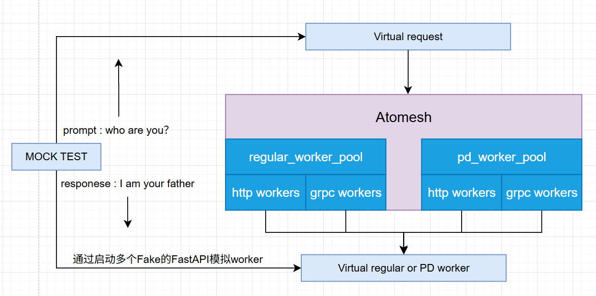

# Atomesh Testing Refactor Design

## 1. 背景与目标

Atomesh 后续重构会持续触碰 router、worker pool、metrics、entry routes 等核心路径。现有测试已经覆盖 API、routing、reliability、security、spec 等行为，但测试范式仍偏向局部逻辑、单点 case 和 HTTP mock worker 场景；单元测试或局部集成测试通过，不代表 HTTP regular、HTTP PD、gRPC regular、gRPC PD 等运行模式都正常。

因此，本次测试方法重构不是继续增加零散 case，而是沉淀一套可复用的本地测试环境：复用测试样本、请求构造、虚拟 worker 和测试执行框架，用同一批样本生成真实请求，经过 Atomesh 路由到不同 worker pool 与 connection mode，再校验返回结果。

架构示意图：

 

概念边界：

```text
测试样本 MockTestCase       = 一组 prompt/request + expected response，用来描述输入和期望输出
虚拟请求 VirtualRequest     = 由测试样本生成的真实 Atomesh API 请求
虚拟 Worker VirtualWorker   = 模拟 regular/PD worker，按测试样本返回响应、延迟或错误
测试执行框架 TestHarness    = 启动 Atomesh app、注册虚拟 worker、发送请求并断言结果

单元测试 Unit Test          = 验证单个函数或小模块在给定输入下的输出、状态变化和错误处理
集成测试 Integration Test   = 验证 Atomesh -> 虚拟 worker 的完整请求链路
沙盒测试 Sandbox Test       = 启动 atom-mesh 二进制，验证本地服务能力
```

## 2. 核心变化

现状：

- 测试主要围绕单点 case、局部逻辑和 HTTP mock worker 展开，能够验证很多 API 行为，但不容易系统覆盖不同运行模式。
- `MockWorker` 更像固定响应的协议 mock，适合验证接口形态，但不支持从 prompt/request 到 expected response 的数据驱动回放。
- gRPC、PD、mixed worker pool、streaming failure 等组合路径覆盖不足，重构 smart router 或 worker pool 时缺少运行模式级别的保护。

重构后：

- 测试从“直接写某个 case”升级为“用同一批测试样本驱动多种运行模式”。
- `MockTestCase` 负责保存输入和期望输出，`VirtualRequest` 负责生成真实 Atomesh API 请求，`VirtualWorker` 负责模拟 regular/PD worker 行为。
- Atomesh 仍走真实路由、worker pool、connection mode 和 streaming 处理逻辑，测试重点从 mock 返回值转向完整请求链路。
- `TestHarness` 沉淀为公共执行层，统一完成 Atomesh app 启动、virtual worker 注册、请求发送和结果断言；底层使用 readiness polling、本地 fixture 和统一测试命令，避免每个 case 重复搭环境。

```text
Before
┌──────────────────────────────────────────────────────────────────┐
│ Current test shape                                               │
│ - tests/api, tests/routing, tests/reliability ...                │
│ - tests/common/mock_worker.rs                                    │
│ - hand-written request / response assertions                     │
│ - mostly HTTP mock worker + fixed template responses             │
└───────────────────────────────┬──────────────────────────────────┘
                                │ current coverage
                                ▼
┌──────────────────────────────────────────────────────────────────┐
│ Current mode coverage                                            │
│ HTTP regular        : strong                                     │
│ HTTP PD             : partial                                    │
│ gRPC regular        : missing smoke                              │
│ gRPC PD / mixed pool: weak                                       │
│ streaming failure   : weak                                       │
│ conclusion          : local tests pass != every mode works       │
└──────────────────────────────────────────────────────────────────┘

After
┌──────────────────────────────────────────────────────────────────┐
│ MockTestCase                                                     │
│ prompt/request + expected response + route mode                  │
└───────────────────────────────┬──────────────────────────────────┘
                                │
                                ▼
┌──────────────────────────────────────────────────────────────────┐
│ TestHarness                                                      │
│ build VirtualRequest; start app; register worker; assert result  │
└───────────────────────────────┬──────────────────────────────────┘
                                │ VirtualRequest
                                ▼
┌──────────────────────────────────────────────────────────────────┐
│ Atomesh                                                          │
│ regular_worker_pool: HTTP / gRPC                                 │
│ pd_worker_pool:      HTTP / gRPC                                 │
│ real router / worker selection / streaming / error mapping       │
└───────────────────────────────┬──────────────────────────────────┘
                                │ dispatch
                                ▼
┌──────────────────────────────────────────────────────────────────┐
│ VirtualWorker                                                    │
│ simulate regular / prefill / decode                              │
│ return response / latency / stream / error                       │
│ report worker path / request order / request id                  │
└──────────────────────────────────────────────────────────────────┘
```

## 3. 目标结构

目标结构不是推翻现有 `tests/api`、`tests/routing`、`tests/reliability` 等目录，而是在现有 case 之下补一层可复用测试架构，使目录能对应上 Before/After 图中的四个角色。

这里的主线是重构已有 `tests/`：保留现有按场景组织的 case，只新增 `tests/test_atomesh/` 作为 Atomesh 测试系统根目录，并新增 `tests/fixtures/` 作为测试样本数据层。`grpc/`、`sandbox/` 这类新测试目录不放入主结构，作为后续补齐运行模式覆盖的扩展项。

```text
Before                                  After
----------------------------------      ----------------------------------
tests/api/routing/...                   tests/api/routing/...
- 按场景组织 case                       - 继续按场景组织 case
- case 内重复搭环境                     - case 调用 TestHarness
- 偏 HTTP mock worker                   - 可切换 HTTP/gRPC、regular/PD

tests/common/mock_worker.rs             tests/test_atomesh/
- 固定响应 mock                         - MockTestCase
- 简单 health/delay/fail                - VirtualRequest
                                        - TestHarness
                                        - VirtualWorker
                                        - MockGrpcWorker

tests/common/                           tests/common/
- 通用 helper 与旧 mock 混在一起         - 仅保留现有通用 helper

无统一样本层                            tests/fixtures/mock_tests/
                                        - prompt/request
                                        - expected response
                                        - route mode
```

```text
tests/
├── common/
│   ├── mock_worker.rs              # 现有 HTTP mock worker，保留
│   ├── test_app.rs                 # 现有：构建 Axum app
│   ├── test_config.rs              # 现有：构建 RouterConfig
│   ├── streaming_helpers.rs        # 现有：SSE helper
│   └── ...
├── test_atomesh/                    # 新增：Atomesh 可复用测试系统根目录
│   ├── mod.rs
│   ├── mock_test_case.rs           # 新增：prompt/response 测试样本
│   ├── virtual_request.rs          # 新增：由样本生成 Atomesh 请求
│   ├── test_harness.rs             # 新增：统一启动 app、注册 worker、发送请求、断言
│   ├── golden_assert.rs            # 新增：统一 response / SSE / worker path 断言
│   ├── virtual_worker.rs           # 新增：virtual regular/PD worker
│   ├── replay_store.rs             # 新增：加载和匹配 mock test cases
│   └── mock_grpc_worker.rs         # 新增：最小 tonic mock backend
├── fixtures/                        # 新增：测试数据层
│   ├── mock_tests/                  # prompt/request + expected response 样本
│   │   ├── who_are_you_chat.json
│   │   ├── generate_basic.json
│   │   ├── pd_prefill_decode.json
│   │   ├── chat_basic.json
│   │   ├── chat_streaming_tool_call.json
│   │   └── responses_basic.json
├── api/                            # 现有：继续保留
├── routing/                        # 现有：继续保留
├── reliability/                    # 现有：继续保留
├── security/                       # 现有：继续保留
├── spec/                           # 现有：继续保留
├── api_tests.rs                    # 现有聚合入口
├── routing_tests.rs                # 现有聚合入口
├── reliability_tests.rs            # 现有聚合入口
├── security_tests.rs               # 现有聚合入口
└── spec_test.rs                    # 现有聚合入口
```

说明：

- `tests/api`、`tests/routing`、`tests/reliability` 等目录继续保留，避免大规模移动现有 case。
- `tests/common/` 只保留当前已有的通用 helper 和旧 mock，避免新测试系统继续堆在 common 里。
- `tests/test_atomesh/` 是本次测试重构的根目录，集中放置 `MockTestCase`、`VirtualRequest`、`TestHarness`、`VirtualWorker` 等新抽象。
- `tests/test_atomesh/mock_test_case.rs` 和 `tests/fixtures/mock_tests/` 对应 `MockTestCase`，保存 prompt/request、expected response 和目标运行模式。
- `tests/test_atomesh/virtual_request.rs` 对应 `VirtualRequest`，把测试样本转成真实 Atomesh API 请求；HTTP/gRPC 的差异发生在 Atomesh 到 worker 的后端连接。
- `tests/test_atomesh/test_harness.rs` 对应 `TestHarness`，统一完成 app 启动、worker 注册、请求发送和结果断言。
- `tests/test_atomesh/virtual_worker.rs` 与 `tests/test_atomesh/mock_grpc_worker.rs` 对应 `VirtualWorker`，分别覆盖 HTTP virtual worker 和最小 gRPC backend。
- `tests/fixtures/mock_tests/` 是新增测试样本层，不是新增测试入口；它让现有 case 可以复用同一批 prompt/request 与 expected response。

## 4. Virtual Worker 设计

`VirtualWorker` 的定位不是完整 SGLang/vLLM backend，而是架构图中的“Virtual regular or PD worker”：通过启动多个 fake worker，模拟 regular、prefill、decode worker 的真实推理行为。测试入口不直接调用 worker，而是先把 mock test 样本构造成 `VirtualRequest` 发给 Atomesh，再由 Atomesh 按 worker pool、connection mode 和路由策略转发到 virtual worker。

实现选择：图中用 FastAPI 表达 fake worker 形态，但 P0 阶段建议优先复用现有 Rust Axum mock worker，避免新增 Python 运行依赖；FastAPI 版本可作为后续跨语言沙盒能力补充。

完整链路：

```text
MockTestCase
  ├── prompt / request
  └── expected response
        │
        ▼
VirtualRequestBuilder
  └── POST /v1/chat/completions 或 /generate
        │
        ▼
Atomesh
  ├── regular_worker_pool
  │   ├── HTTP virtual worker
  │   └── gRPC virtual worker
  └── pd_worker_pool
      ├── HTTP prefill/decode virtual workers
      └── gRPC prefill/decode virtual workers
        │
        ▼
Golden Assert
  └── actual response ~= expected response
```

### Mock Test Fixture 示例

```json
{
  "name": "who_are_you_chat",
  "model": "test-model",
  "endpoint": "/v1/chat/completions",
  "route": {
    "worker_kind": "regular",
    "connection_mode": "http"
  },
  "request": {
    "messages": [
      {
        "role": "user",
        "content": "who are you?"
      }
    ],
    "stream": false
  },
  "expected_response": {
    "status": 200,
    "body": {
      "id": "chatcmpl-test",
      "object": "chat.completion",
      "choices": [
        {
          "index": 0,
          "message": {
            "role": "assistant",
            "content": "I am your father"
          },
          "finish_reason": "stop"
        }
      ]
    }
  },
  "simulation": {
    "ttft_ms": 30,
    "chunk_interval_ms": 5,
    "fail_after_chunks": null
  }
}
```

### 测试调用方式

```rust
let case = MockTestCase::from_fixture("tests/fixtures/mock_tests/who_are_you_chat.json")?;

let result = TestHarness::new()
    .with_case(case)
    .start_atomesh()
    .register_virtual_workers()
    .send_virtual_request()
    .await?;

result.assert_response()?;
result.assert_worker_path()?;
```

这段代码表达的是测试使用方式，不要求每个 case 都手动启动 worker。`TestHarness` 内部负责：

- 从 `MockTestCase` 生成 `VirtualRequest`。
- 按 `route.worker_kind` 和 `route.connection_mode` 启动 virtual workers。
- 启动 Atomesh app 并注册 worker。
- 发送请求到 Atomesh 真实入口。
- 对返回结果、worker path、request order、request id 做统一断言。

### 能力边界

- `MockTestCase` 负责描述样本：prompt/request、expected response、route mode、simulation。
- `VirtualRequest` 负责请求生成：从 prompt/messages/input_ids 构造 `/generate`、`/v1/chat/completions`、`/v1/completions`、`/v1/responses` 请求。
- `VirtualWorker` 负责行为模拟：返回普通响应、stream chunk、延迟、错误，或模拟 prefill/decode 交互。
- `TestHarness` 负责执行链路：启动 app、注册 worker、发送请求、收集 response/trace、统一断言。
- 同一份样本应能切换 HTTP regular、HTTP PD、gRPC regular、gRPC PD 等运行模式；gRPC smoke 可作为后续扩展逐步补齐。

## 5. CI 分层

```text
local quick（本地快速验证）:
  cargo test -p atom-mesh --lib
  cargo test -p atom-mesh --test spec_test

ci quick（当前默认回归）:
  cargo test -p atom-mesh --lib
  cargo test -p atom-mesh --test api_tests
  cargo test -p atom-mesh --test routing_tests
  cargo test -p atom-mesh --test reliability_tests
  cargo test -p atom-mesh --test security_tests
  cargo test -p atom-mesh --test spec_test

ci full（后续扩展后启用）:
  cargo test -p atom-mesh --test grpc_tests
  cargo test -p atom-mesh --test sandbox_tests

nightly（可选长期任务）:
  real backend smoke
  long reliability
  benchmark / load guard stress
```

说明：

- `local quick` 和 `ci quick` 只包含当前已有测试入口，适合作为本次测试重构的默认验收范围。
- `ci full` 中的 `grpc_tests`、`sandbox_tests` 是后续新增入口，不作为本次主结构的前置条件。
- 默认回归必须无 GPU、无真实 inference backend、无外部网络下载，并默认使用随机端口。

## 6. 实施计划

建议按 5 个工作日排布。


| 阶段    | 时间  | 主要工作                                                                             | 交付物                                     |
| ----- | --- | -------------------------------------------------------------------------------- | --------------------------------------- |
| Day 1 | 1 天 | 修正测试命令；改造 `MockWorker::start/shutdown`；端口和 readiness polling 收敛。                 | `TestHarness` 基础稳定；README 命令正确。         |
| Day 2 | 1 天 | 新增 `MockTestCase`、`VirtualRequest`、golden assert；打通 regular HTTP virtual worker。 | mock test 样本可生成请求并完成 response 校验。       |
| Day 3 | 1 天 | 增加 `VirtualWorker` streaming、PD prefill/decode replay。                           | SSE、tool call、reasoning、PD fixture 可断言。 |
| Day 4 | 1 天 | 预留 `MockGrpcWorker` 接口；将现有 case 接入 `TestHarness`；整理运行模式矩阵。                       | 现有测试可复用测试系统；gRPC smoke 有后续扩展入口。         |
| Day 5 | 1 天 | 建立重构 P0 清单；补 metrics/router/worker pool/entry routes 关键测试；整理 CI 分层。              | 每个重构点有 P0 测试入口；CI quick/full 边界明确。      |


如果工期紧张，优先级为：

```text
P0: TestHarness 稳定 + MockTestCase/VirtualRequest + regular HTTP virtual worker + P0 清单
P1: streaming replay + gRPC regular smoke + 默认测试无外部网络依赖
P2: gRPC PD smoke + sandbox binary startup + nightly backend compatibility
```

## 7. 测试与验收

- 默认 `cargo test -p atom-mesh` 不依赖 GPU、真实 engine 或外部网络。
- `MockWorker` 启停不依赖固定 sleep；端口默认随机分配。
- `MockTestCase` 能生成 `VirtualRequest`，通过 Atomesh 真实入口完成请求。
- `VirtualWorker` 能根据 mock test fixture 匹配请求并返回 golden response。
- HTTP regular、HTTP PD 通过现有测试接入 `TestHarness`；gRPC regular、gRPC PD 作为后续 smoke 扩展项。
- 重构 metrics、router、worker pool、entry routes 前，有对应 P0 测试清单。
- `tests/README.md` 与实际 package name、CI quick/full/nightly 命令一致。

