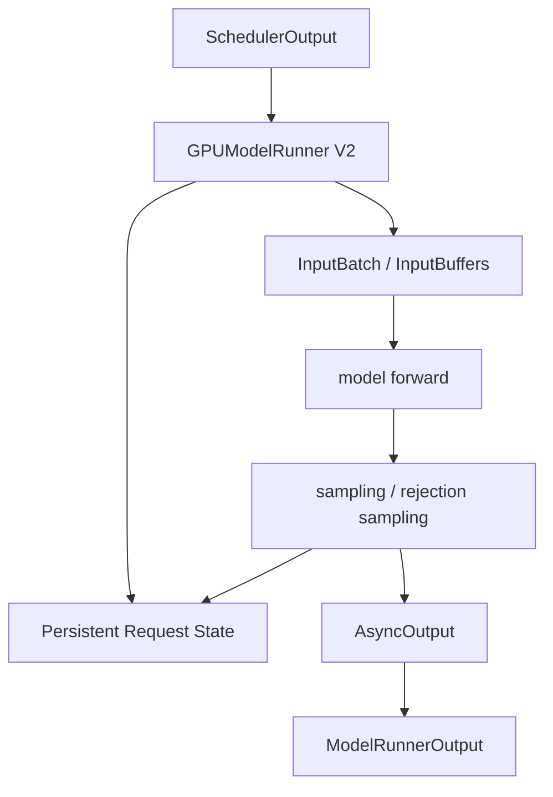
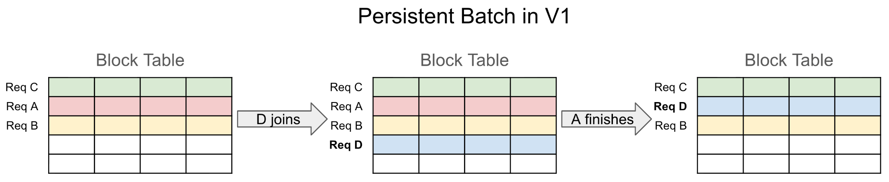
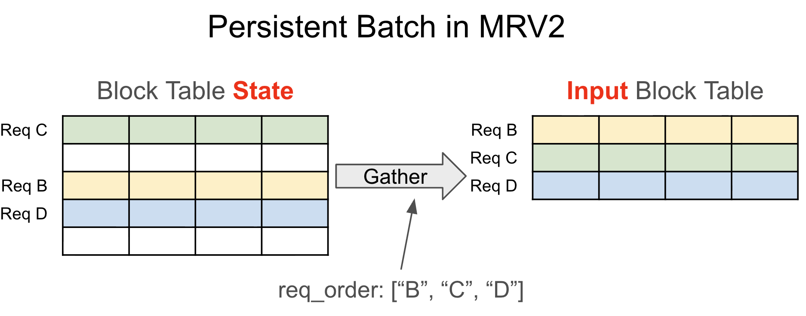
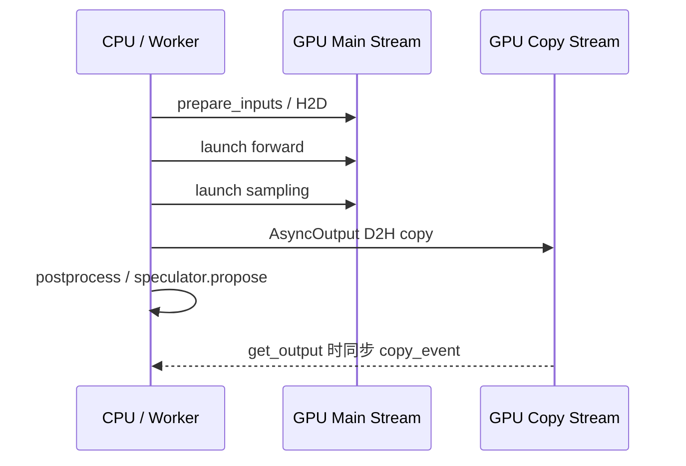
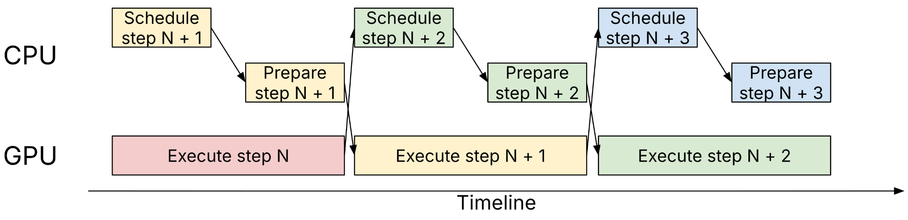
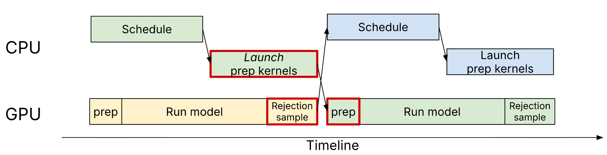
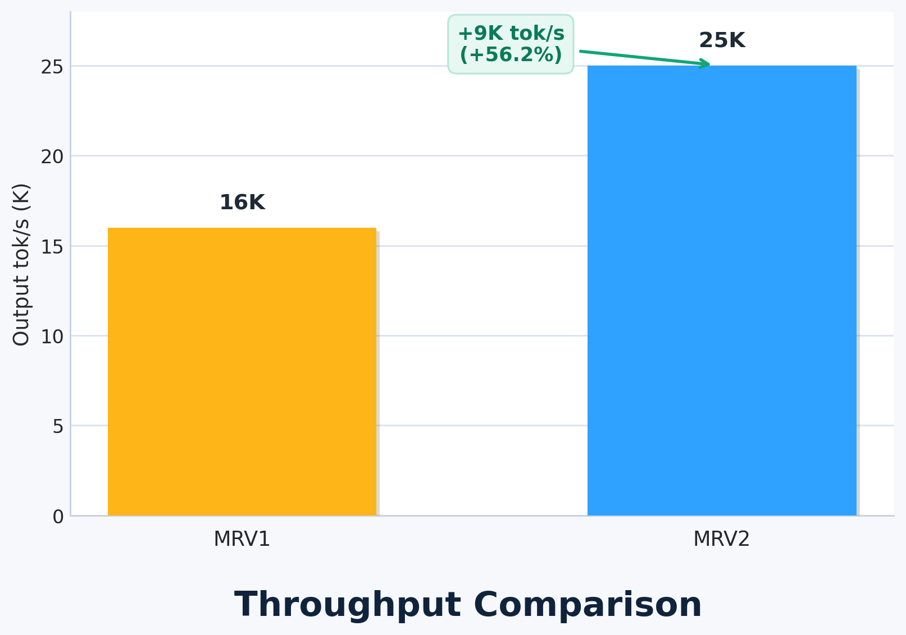
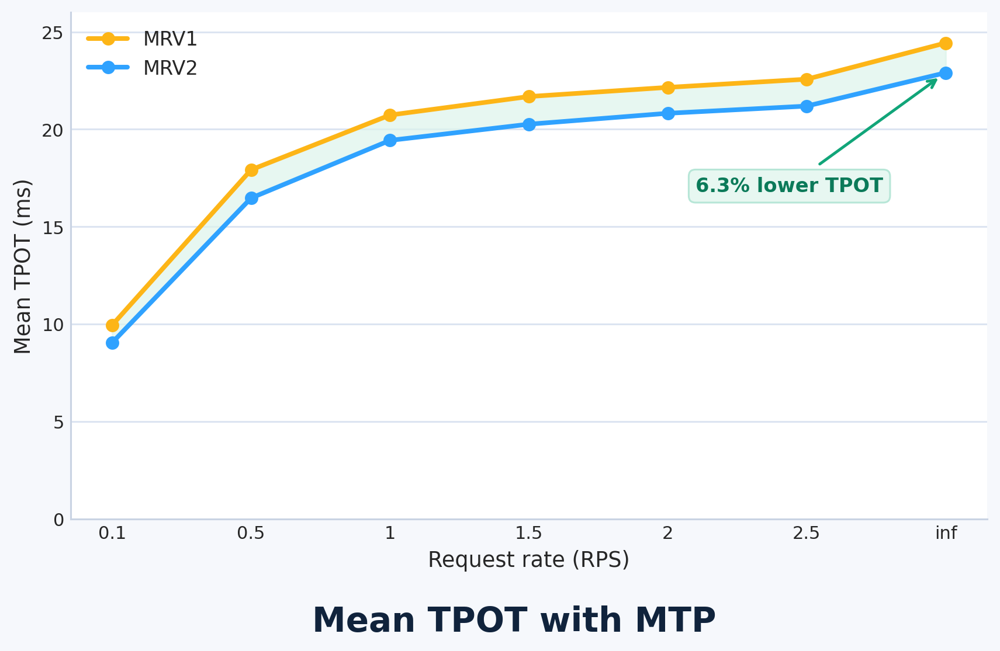

# 版本特性

> 说明：官方 `v0.25.1` 是基于 `v0.25.0` 的补丁版本，真正的大版本特性主要来自 `v0.25.0`。后续学习新特性时，可以以 `v0.25.0` 的架构/功能变化为主线。

## v0.25.0 特性基线

1. **Model Runner V2 成为 dense 模型默认执行路径**
   - MRv2 扩展了量化模型支持，并新增 EVS、realtime embeddings、Mamba hybrid prefix caching、多模态 prefix 双向 attention、兼容 full CUDA graph 的动态 speculative decoding。

### Model Runner V2 设计主线

Model Runner 是 worker 内部负责“按 scheduler 输出准备输入、执行模型 forward、采样、更新请求状态并返回输出”的核心执行器。MRv2 不是对 V1 做局部补丁，而是基于 vLLM 在 continuous batching、异步调度、Triton kernel、UVA、CUDA Graph 和 speculative decoding 上的经验重新设计执行核心。

官方设计文档把 MRv2 的目标概括为：更简洁、更高效、更模块化。对应到 `v0.25.0`，MRv2 已成为 dense 模型默认路径，因此 ATOM plugin 适配时应优先按 MRv2 的数据流和状态边界理解问题。



#### 1. Persistent Batch：长期请求状态与每步输入解耦

V1 的 persistent batch 会直接把持久状态张量当作模型/采样器输入。这样虽然能减少每步从头构造输入的 CPU 开销，但也带来了严格的布局和排序要求：请求加入、完成、抢占时，经常需要复杂的行重排，并且还要维护冗余的 `CachedRequestState`。



MRv2 的做法是：

1. 预分配固定大小的长期状态表，例如 `max_num_reqs` 行。
2. 每个活跃请求在生命周期内占用一个稳定 slot。
3. 每个 step 根据 scheduler 输出生成临时 `InputBatch`。
4. `InputBatch.idx_mapping` 把当前 batch row 映射回长期 request slot。
5. 抢占按完成处理；恢复时作为新状态重新加入。

本地代码中，长期请求状态由 `RequestState` 维护：

```python
# vllm/v1/worker/gpu/states.py
class RequestState:
    def __init__(...):
        self.req_id_to_index: dict[str, int] = {}
        self.index_to_req_id: dict[int, str] = {}
        self.free_indices = list(range(max_num_reqs))

        self.all_token_ids = StagedWriteTensor(...)
        self.prompt_len = UvaBackedTensor(...)
        self.prefill_len = UvaBackedTensor(...)
        self.total_len = StagedWriteTensor(...)
        self.num_computed_tokens = StagedWriteTensor(...)
        self.last_sampled_tokens = torch.zeros(...)
        self.draft_tokens = torch.zeros(...)
```

当前 step 的执行视图由 `InputBatch` 描述：

```python
# vllm/v1/worker/gpu/input_batch.py
@dataclass
class InputBatch:
    req_ids: list[str]                  # batch_idx -> req_id
    idx_mapping: torch.Tensor           # batch_idx -> req_state_idx
    num_scheduled_tokens: np.ndarray
    query_start_loc: torch.Tensor
    seq_lens: torch.Tensor
    input_ids: torch.Tensor
    positions: torch.Tensor
    logits_indices: torch.Tensor
```

`prepare_inputs()` 每步从 scheduler 输出和长期状态生成本轮输入：

```python
# vllm/v1/worker/gpu/model_runner.py
req_ids = sorted(num_tokens_per_req, key=num_tokens_per_req.get)
num_scheduled_tokens = np.fromiter(..., dtype=np.int32, count=num_reqs)

idx_mapping_iter = map(self.req_states.req_id_to_index.get, req_ids)
idx_mapping_np = np.fromiter(idx_mapping_iter, dtype=np.int32, count=num_reqs)
idx_mapping = async_copy_to_gpu(idx_mapping_np, device=self.device)
```

这个设计对 continuous batching 很关键。每一轮 batch 可能都不同：

```text
step N:   A decode, B decode, C prefill
step N+1: A decode, C prefill next chunk, D enters
step N+2: B finished, A decode, C decode, D prefill
```

长期状态稳定放在 `RequestState` / `model_state` / `block_tables` 中；本轮只生成轻量 `InputBatch`。一句话总结：**`RequestState` 回答“请求整体进行到哪里了”，`InputBatch` 回答“这一轮 forward 要怎么喂给模型”。**



#### 2. Async-first：异步优先执行

vLLM 现在严重依赖异步调度：GPU 执行 step N 时，scheduler/worker 尽量准备 step N+1，减少 CPU/GPU 互相等待。V1 的异步支持是后补的，MRv2 则假设核心模型执行循环是一个尽量没有 CPU 同步点的 CUDA stream，CPU 入口只负责把工作排队到 stream。





V2 初始化独立的 copy stream，并按并发 batch 数配置 UVA buffer pool：

```python
# vllm/v1/worker/gpu/model_runner.py
self.output_copy_stream = torch.cuda.Stream(self.device)
set_default_max_concurrency(vllm_config.max_concurrent_batches)
```

输入侧使用 pinned memory + non-blocking H2D：

```python
# vllm/v1/worker/gpu/buffer_utils.py
def async_copy_to_gpu(x, out=None, device=None):
    if isinstance(x, np.ndarray):
        x = torch.from_numpy(x)
    if out is None:
        out = torch.empty_like(x, device=device)
    pinned = x.pin_memory()
    return out.copy_(pinned, non_blocking=True)
```

输出侧使用 `AsyncOutput` 在 copy stream 上异步 D2H，只有 `get_output()` 时才同步：

```python
# vllm/v1/worker/gpu/async_utils.py
with stream(copy_stream, main_stream):
    copy_stream.wait_stream(main_stream)
    self.sampled_token_ids = async_copy_to_np(sampler_output.sampled_token_ids)
    self.num_sampled_tokens_np = async_copy_to_np(num_sampled_tokens)
    self.copy_event.record(copy_stream)

def get_output(self) -> ModelRunnerOutput:
    self.copy_event.synchronize()
```

`sample_tokens()` 里先创建 `AsyncOutput`，再继续 postprocess/spec decode proposal，让 D2H copy 与 CPU 后处理重叠：

```python
# vllm/v1/worker/gpu/model_runner.py
async_output = AsyncOutput(
    model_runner_output=model_runner_output,
    sampler_output=sampler_output,
    num_sampled_tokens=num_sampled,
    main_stream=self.main_stream,
    copy_stream=self.output_copy_stream,
)
self.postprocess_sampled(...)
draft_tokens = self.speculator.propose(...)  # if enabled
```

需要 D2H 的主要内容包括 sampled token、每请求实际采样 token 数、logprobs/prompt logprobs、debug 统计如 `num_nans`、pooling output，以及 structured output 场景下需要 scheduler 校验的 draft tokens。`hidden_states`、KV cache、attention metadata、positions、seq_lens、block tables 等一般应留在 GPU。



#### 3. 移除异步屏障：避免 CPU/GPU 共享临时 buffer 竞态

异步执行要求 CPU 操作保持非阻塞，但如果 CPU 和 GPU 同时访问同一块 pinned CPU buffer，会产生竞态。V1 通过显式异步屏障规避，但这会减少重叠、容易漏保护、结构也不灵活。

MRv2 的原则是：**持久 CPU 状态不要直接作为异步 copy 源；copy 前生成临时 pinned 副本或使用并发 buffer pool**。这样 CPU 可以继续写持久状态，GPU 读取的是不再被 CPU 修改的临时副本。

本地实现中可以看到 `UvaBackedTensor` 保留非 pinned CPU source of truth，再用 `UvaBufferPool` 做并发 UVA view：

```python
# vllm/v1/worker/gpu/buffer_utils.py
class UvaBackedTensor:
    def __init__(...):
        self.cpu = torch.zeros(size, dtype=dtype, device="cpu", pin_memory=False)
        self.np = self.cpu.numpy()
        self.pool = UvaBufferPool(size, dtype, max_concurrency)
        self.gpu = self.pool.copy_to_uva(self.np)
```

#### 4. StagedWriteTensor：大型状态增量写入

对于 block table、`num_computed_tokens`、`all_token_ids` 等大型或不规则状态，MRv2 不希望每一步完整 CPU->GPU 复制。`StagedWriteTensor` 的流程是：

1. 基础张量保留在 GPU 或 UVA view 中。
2. CPU 只暂存本 step 的差异。
3. 将差异打包成连续 buffer。
4. H2D 复制差异。
5. 启动 kernel 把差异写入目标张量。

代码示例：

```python
# vllm/v1/worker/gpu/buffer_utils.py
class StagedWriteTensor:
    def stage_write(self, index: int, start: int, x: Iterable[int]) -> None:
        self._staged_write_indices.append(index)
        self._staged_write_starts.append(start)
        self._staged_write_contents.extend(x)

    def apply_write(self) -> None:
        indices_uva = self.write_indices.copy_to_uva(...)
        write_contents = async_tensor_h2d(...)
        _apply_write_kernel[(n,)](...)
```

这类设计直接服务 persistent batch：长期状态稳定存在，变化只以增量形式写入。

#### 5. GPU 原生输入元数据准备

MRv2 使用 Triton kernel 准备 `input_ids`、`positions`、`seq_lens`、`logits_indices` 等输入元数据，减少 Python 循环和 CPU 组装开销，也让 speculative decoding 中 CPU 尚不了解的值可以由 GPU 直接推导。

例如 `prepare_prefill_inputs()` 和 `prepare_pos_seq_lens()`：

```python
# vllm/v1/worker/gpu/input_batch.py
prepare_prefill_inputs(
    self.input_buffers.input_ids,
    self.req_states.next_prefill_tokens,
    idx_mapping,
    query_start_loc,
    self.req_states.all_token_ids.gpu,
    self.req_states.prefill_len.gpu,
    self.req_states.num_computed_tokens.gpu,
)

prepare_pos_seq_lens(
    idx_mapping,
    query_start_loc,
    self.req_states.num_computed_tokens.gpu,
    self.input_buffers.positions,
    self.input_buffers.seq_lens,
)
```

对应 Triton kernel 根据 `idx_mapping` 访问长期 request slot：

```python
@triton.jit
def _prepare_pos_seq_lens_kernel(...):
    req_state_idx = tl.load(idx_mapping_ptr + req_id)
    num_computed_tokens = tl.load(num_computed_tokens_ptr + req_state_idx)
    start = tl.load(query_start_loc_ptr + req_id)
    end = tl.load(query_start_loc_ptr + req_id + 1)
    seq_len = num_computed_tokens + (end - start)
    tl.store(seq_lens_ptr + req_id, seq_len)
```

#### 6. Triton 原生采样器

MRv2 将采样路径更多放到 Triton 中，重点收益包括：

1. Gumbel sampling kernel 避免显式实例化完整 softmax。
2. top-k logprobs 先找 top-k token，再只为选中 token 计算 logprob，降低峰值显存。
3. prompt logprobs 支持更细粒度分块，降低长 prompt 内存峰值。
4. speculative decoding 下，采样状态不需要扩展到每个 logits 的形状，而是在 kernel 内通过 `idx_mapping` 间接寻址到对应 request state。

对 plugin 来说，采样相关适配要重点关注 `sampler_output.sampled_token_ids`、`num_sampled`、`num_rejected`、`draft_tokens` 与后续 `postprocess_sampled()` 的状态更新是否一致。

#### 7. 模块化：主 runner 变薄

MRv2 强调主路径只保留所有模型共享的稳定逻辑，把特性复杂度移到专门模块：

```python
# vllm/v1/worker/gpu/model_runner.py
from vllm.v1.worker.gpu.input_batch import InputBatch, InputBuffers
from vllm.v1.worker.gpu.sample.sampler import Sampler
from vllm.v1.worker.gpu.spec_decode import init_speculator
from vllm.v1.worker.gpu.cudagraph_utils import ModelCudaGraphManager
```

本地目录也体现了这个拆分：

```text
vllm/v1/worker/gpu/
  model_runner.py
  input_batch.py
  buffer_utils.py
  cudagraph_utils.py
  sample/
  spec_decode/
  model_states/
  mm/
```

这使 ATOM plugin 适配时可以按模块定位问题：attention 看 `prepare_attn()` / attention backend，MoE/quant 看模型层和 kernel，采样看 `sample/`，spec decode 看 `spec_decode/`，多模态看 `mm/` 和 `model_states/`。

#### 8. 不滥用 dummy_run

V1 中 `dummy_run` 同时承担内存 profiling、`torch.compile`、CUDA graph capture、warmup、空 DP forward 等职责，导致 `execute_model` 和 dummy path 行为差异容易产生 bug。

MRv2 将这些职责拆开：`execute_model()` 支持真实执行和必要的空运行；CUDA graph capture 使用专门路径；profiling/warmup 不再强行塞进一条复杂 dummy 分支。当前 runner 中 dummy 分支只构造 `InputBatch.make_dummy()` 和必要 attention metadata，不污染真实请求状态。

#### 9. 显式 CUDA Graph 管理

V1 的 CUDA Graph 处理比较隐式，MRv2 使用 graph manager 显式管理 capture/replay，并在运行时区分 `FULL`、`PIECEWISE`、`NONE`：

```python
# vllm/v1/worker/gpu/model_runner.py
if batch_desc.cg_mode == CUDAGraphMode.FULL:
    model_output = self.cudagraph_manager.run_fullgraph(batch_desc)
elif batch_desc.cg_mode == CUDAGraphMode.PIECEWISE:
    model_output = self.cudagraph_manager.run_pw_graph(self.model, model_inputs)
else:
    model_output = self.model(**model_inputs)
```

`v0.25.0` 中 MRv2 新增“dynamic speculative decoding compatible with full CUDA graphs”，说明 spec decode 和 full graph 的组合已经成为重点路径。plugin 遇到 graph 下精度/崩溃问题时，优先检查 `batch_desc.cg_mode`、padding、`InputBuffers` shape、`prepare_attn()`、`model_state.prepare_inputs()`。

### v0.25.0 中 MRv2 相关新增能力

1. **dense 模型默认使用 MRv2**
   - 升级后 dense 模型会优先走 `vllm/v1/worker/gpu/model_runner.py` 的 V2 路径，旧 `gpu_model_runner.py` 不再是主要适配对象。

2. **EVS**
   - 多模态 embedding pruning 路径进入 MRv2，涉及 `model_states/default.py` 中的 `mm_pruner` 和多模态 embedding 重算。

3. **realtime embeddings**
   - embedding / pooling 类 runner 更依赖 `pool()`、`AsyncPoolingOutput` 和 pooling runner 的异步输出路径。

4. **Mamba hybrid prefix caching**
   - Mamba/linear-attention hybrid 模型有专门 `MambaHybridModelState`，`preprocess_state()` 会在 forward 前迁移 recurrent state，保证 align cache 语义。

5. **多模态 prefix bidirectional attention**
   - 多模态 prefix attention metadata 由 `model_state.prepare_attn()` 和 attention backend 共同处理，适配时要关注 `mm_req_doc_ranges`、positions、slot mapping。

6. **动态 speculative decoding + full CUDA graph**
   - spec decode 的 draft token、rejection sampling、`num_sampled/num_rejected`、`AsyncOutput`、graph replay shape/padding 都需要保持一致。

官方博客中的性能图可以作为理解 MRv2 收益来源的参考：小模型/强 GPU 场景下 host 侧开销占比更高，GPU-native input preparation 对吞吐提升更明显；spec decode 场景下，消除 CPU-GPU 同步点可以降低 TPOT。





### 对 ATOM plugin 适配的关注点

1. 旧代码如果依赖 `gpu_model_runner.py` 中的 `self.input_batch`、`self.requests`、`sampling_metadata` 等内部结构，需要重新映射到 MRv2 的 `RequestState`、`InputBatch`、`model_state`、sampler/speculator 子模块。
2. 自定义 attention / MoE / quant kernel 要确认是否依赖 V1 的 `positions`、`seq_lens`、`query_start_loc`、`slot_mapping` 形状和 padding 假设。
3. 如果模型依赖 MTP、DFlash、EAGLE、DSpark 或多 token sampling，要重点检查 `sample_tokens()` 后的异步输出、`draft_tokens` 更新、下一 step 输入准备是否一致。
4. 如果问题只在 CUDA Graph 下出现，优先检查 `CUDAGraphMode.FULL/PIECEWISE`、`InputBuffers` padding、graph capture size 和 model-specific inputs。
5. 如果问题只在 Mamba/Hybrid 模型出现，优先检查 `model_state.preprocess_state()`、`postprocess_state()`、`num_accepted_tokens_gpu` 和 block boundary state copy。

2. **PagedAttention 被移除**
   - 老的 attention 实现被删除，V1/MRv2 backend 成为标准路径。升级 plugin 时需要重点关注是否仍依赖旧 PagedAttention 接口或假设。

3. **Transformers modeling backend 性能追平 native vLLM**
   - Transformers backend 获得 FP8 MoE 支持、CUDA graph + embed scaling 修复，并迁移 GPTBigCode/Starcoder2、RoBERTa 等模型。

4. **模型支持扩展**
   - 新增 LLaVA-OneVision-2、Unlimited OCR、MOSS-Transcribe-Diarize、openai/privacy-filter、Hy3。
   - GLM-5 / DeepSeek-V3.2 进入 model zoo，MiniMax-M3 支持 pipeline parallelism 和 NVFP4。

5. **Streaming Parser Engine**
   - 引入统一的 tool-call / reasoning 流式解析框架。
   - 新增 Kimi k2.5/k2.6/k2.7 parser，并迁移 seed_oss、DeepSeek V4 parser。

6. **Speculative decoding 增强**
   - 支持异构 vocabulary 的通用 speculative decoding（TLI）。
   - 新增 DSpark、DFlash drafter/backends，并优化 draft token 通信与 rejection sampling 校验。

7. **硬件与性能优化**
   - ROCm 迁移到 torch stable ABI，新增 AITER FlashAttention MLA prefill backend、AITER MoE / custom all-reduce 等优化。
   - NVIDIA/Blackwell、Intel XPU、CPU、RISC-V 等平台均有 kernel 或 backend 性能改进。

8. **大规模服务与分布式能力**
   - sequence parallelism 不再强制依赖 DP，并带来一定吞吐提升。
   - 改进 NCCL symmetric memory、FlashInfer all-reduce、DP supervisor、PD disaggregation、Mooncake/NIXL connector 等能力。

9. **量化能力增强**
   - 支持 2/3/5/6/7-bit pack-quantized weight-only inference。
   - 增强 NVFP4、FP8、Marlin、MXINT4、W8A8 等路径，并修复多项 mixed precision / quant scheme 兼容问题。

10. **API、前端与安全**
    - OpenAI compatibility 增加 Responses API namespace tools、per-request timing metrics、render token offsets、`return_loss_mask` 等。
    - Rust frontend 支持 HTTPS/mTLS、DP supervisor、profiler control routes。
    - 增加图像 decompression bomb、NaN audio、tokenizer workload、GPU video backend selection 等安全防护。

## 后续学习重点

建议优先按以下顺序学习和适配：

1. MRv2 默认路径与 plugin 模型执行链路变化。
2. PagedAttention 删除后 attention/backend 相关接口变更。
3. ROCm + AITER + torch stable ABI 对 ATOM plugin 的影响。
4. GLM-5、DeepSeek-V3.2、MiniMax-M3、Kimi parser 等目标模型相关改动。
5. NVFP4、FP8、MoE、FlashInfer allreduce/RMSNorm 融合等量化与正确性风险点。
