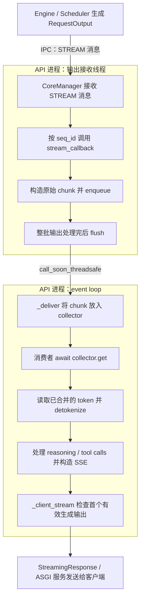

# API Server 分析

本文记录 ATOM API Server 的代码结构、请求处理流程和性能相关机制，随后续分析逐章补充。主题索引见 [ATOM Wiki](atom_wiki.md)。

## 1. Streaming callback：从引擎输出到客户端 SSE

本章更新至 2026-09-17 的 metrics 精简实现（评审终点为 `c2c68165d`，精简修改位于 `mengqng/metrics_simplification` 分支），主要讨论 `stream=true`、`n=1`、使用 `StreamOutputCollector` 的输出路径，以 `/v1/chat/completions` 为例。`n>1` 的差异在本章末尾说明。

### 1.1 Callback 的职责

`stream_callback()` 接收引擎生成的 token，把结果交给对应请求的流式输出链路。它是连接引擎输出接收线程与 HTTP 请求消费者的入口。

每次调用携带一个 `RequestOutput`，包含本次新增的 token IDs、是否结束、结束原因，以及可选的 KV transfer 元数据等。模型计算与采样在引擎侧完成；callback 将这些结果整理成原始 chunk 并缓冲，后续消费者负责文本解码和 SSE 输出。

一次 callback 调用可以携带一个或多个 token，也可以只携带结束信息。它与最终发送的 SSE frame 不存在一一对应关系：积压的 token chunk 可以先合并，reasoning/tool-call 处理也会影响输出 frame 的组织方式。

### 1.2 创建请求时如何注册

`setup_streaming_request()` 为一个请求创建 `StreamOutputCollector`，取得当前 event loop，并通过 `StreamBatchDispatcher.new_state()` 创建 `StreamState`，其中保存增量 detokenizer 和交付计时状态。

随后创建一个闭包：

```python
def stream_callback(request_output: RequestOutput) -> None:
    if (
        track_output_delivery
        and request_output.output_tokens
        and timing.scheduler_output_at is None
    ):
        timing.scheduler_output_at = request_output.scheduler_output_at
    _send_stream_chunk_direct(
        request_output, request_id, stream_collector, stream_loop, detokenizer
    )
```

这里变量名 `detokenizer` 实际指向 `StreamState`；`timing` 是请求自身的 `RequestTiming` 对象，`track_output_delivery` 在请求 setup 时根据启动配置确定。闭包记住该请求的 ID、collector、event loop 和状态，使返回结果能够找到对应的 HTTP 请求。

`io_processor.preprocess()` 将 callback 关联到 `Sequence`。提交请求时，`CoreManager.add_request()` 先把它存入 API 进程本地的 `_seq_id_to_callback[seq.id]`，再把 `seq.stream_callback` 设为 `None`，之后序列化 Sequence 发给 engine。callback 函数本身保留在 API 进程中，engine 返回输出时靠 `seq_id` 找回它。

### 1.3 运行时调用链与线程边界



1. **接收引擎输出。** `CoreManager` 的输出接收线程收到 `STREAM` 消息，消息包含一批 `(seq_id, RequestOutput)`。它查找本地 callback 映射，逐个调用 `callback(request_output)`。
2. **缓冲原始 chunk。** `stream_callback()` 调用 `_send_stream_chunk_direct()`；后者用 `_build_stream_chunk()` 整理 token IDs、结束状态等，再调用 dispatcher 的 `enqueue()`。此时结果进入当前输出线程的本地缓冲。
3. **批量通知 event loop。** 一批输出的 callbacks 处理完后，`CoreManager` 调用 `flush_stream_batch()`。dispatcher 按目标 event loop 分组，每组调用一次 `loop.call_soon_threadsafe(self._deliver, items)`，减少逐请求通知 event loop 的成本。
4. **合并尚未消费的输出。** `_deliver()` 在 event loop 上调用 collector 的 `put_nowait()`。同一条流尚未被读取的 token chunk 会合并，消费者稍后一次性取走；不会为了凑批次额外等待定时器。
5. **生成文本与 SSE。** 响应生成器通过 `await stream_collector.get()` 取得 chunk。`get()` 在读取时调用增量 detokenizer；chat 响应生成器再处理 reasoning、tool calls 等内容并构造 SSE。外层 `_client_stream()` 观察有效生成内容，随后由 `StreamingResponse` 和 ASGI 服务交付给客户端。

在这条路径中，detokenize 同步运行于 event loop。合并未读 chunk 可以减少重复解码工作，但较大的解码任务仍可能占用 event loop，延迟其他请求。dispatcher 对普通 queue 消费者还保留了另一种解码路径，不能把这里的线程结论直接推广到所有调用者。

### 1.4 “非空 callback”是什么意思

准确表述是：**携带非空 token 列表的 callback 调用**。判断条件是：

```python
if (
    track_output_delivery
    and request_output.output_tokens
    and timing.scheduler_output_at is None
):
    timing.scheduler_output_at = request_output.scheduler_output_at
```

| `output_tokens` 示例 | 含义 | 诊断开启时是否接收首次输出时间戳 |
| --- | --- | --- |
| `[123]` | 本次交付一个新 token | 是 |
| `[123, 456]` | 本次交付多个新 token，例如 MTP 接受了多个 token | 是 |
| `[]` | 本次没有新 token，例如仅通知请求结束 | 否 |

这个条件只控制诊断时间戳的复制。空 token 的结束通知仍然需要通过 callback 和 collector 传递，消费者依赖 `finished`、`finish_reason` 等信息结束响应。

token 列表非空，也不保证本次已经产生用户可见的文本。增量解码可能暂时输出空串，后续 reasoning/tool-call 处理也可能缓冲内容。因此“首个带 token 的 callback”和“首个带有效生成内容的 SSE”是两个不同时间点。

### 1.5 输出 callback 与可选 metrics

| 函数或状态 | 职责 | 频率 |
| --- | --- | --- |
| `stream_callback()` | 交付 Sequence 输出；诊断开启时复制首个带 token 输出携带的 scheduler 时间戳 | 每批输出调用，包含结束通知 |
| `_send_stream_chunk_direct()` | 整理原始 chunk 并交给 dispatcher | 每批输出调用，已移除 callback 时钟读取和 metrics 去重 |
| `RequestTiming.scheduler_output_at` | 请求自身保存 scheduler 首输出的 wall-clock 时间 | 诊断开启时写入一次，不使用全局时间戳表 |
| `_client_stream()` | 观察首个有效生成内容，记录整体 TTFT 和可选的输出交付耗时 | 每请求最多记录一次 |

`ATOM_ENABLE_METRICS_OUTPUT_DELIVERY=1` 开启
`atom:ttft_output_delivery_seconds`，需要在 API 和 engine 启动前一致设置。
它直接测量 scheduler 首次生成输出到 `_client_stream()` 观察到首个有效生成内容的时间，
覆盖 IPC、线程交接、detokenize、reasoning/tool-call 处理和 SSE 构造。
终点仍在服务端生成器内，不包含网络发送和客户端接收。

默认关闭时，不注册这个 histogram，也不在 scheduler 记录诊断 wall-clock 时间。
开启后，scheduler 仅在第一个携带 token 的 `RequestOutput` 中传递时间戳；
callback 复制时间戳而不读取时钟。空输出不消耗首次时间戳，后续输出不覆盖首次值。
`RequestTiming` 随请求释放，因此无需维护或清理全局 callback 时间戳表。
跨主机时要求 wall clock 同步；负数和非有限的 elapsed time 不记录，正向时钟偏差仍需由部署保证。

此前的 `ttft_output_to_callback_seconds`、`ttft_callback_to_sse_seconds` 已删除，
由上述直接计时的单一指标替代；`api_detokenize_chunk_seconds` 也已删除。
正常的 token、结束通知和 SSE 交付流程保持不变。取舍和迁移记录见
[Metrics review](metrics_review_3ff61024_c2c68165.md)。

### 1.6 结束与 fanout 的差异

正常收到 `finished=True` 的输出时，`CoreManager` 会先调用 callback 传递最终结果，再移除 `_seq_id_to_callback` 中的对应项。请求级清理由响应链路完成；时间戳随请求计时对象的生命周期释放。

`n>1` 时，每个 sibling 有自己的 callback 和 detokenizer 状态，共用一个 collector。`_send_stream_chunk_tagged()` 为 chunk 附带 `sibling_index`，collector 按 tag 分别合并，避免混合不同输出序列。这条路径不设置 `RequestTiming.scheduler_output_at`，因此可选的 output delivery 指标仍只覆盖 `n=1`；不将多个 sibling 的不同起点混为同一个样本。

### 1.7 代码入口

链接行号对应本章更新时的工作区；后续代码移动时可用函数名定位。

| 入口 | 位置 |
| --- | --- |
| `RequestOutput` 字段定义 | [request.py](../atom/model_engine/request.py#L9) |
| `setup_streaming_request()` 创建 callback | [api_server.py](../atom/entrypoints/openai/api_server.py#L1209) |
| `CoreManager.add_request()` 保存 callback | [engine_core_mgr.py](../atom/model_engine/engine_core_mgr.py#L842) |
| 接收 `STREAM`、调用 callback、整批 flush | [engine_core_mgr.py](../atom/model_engine/engine_core_mgr.py#L595) |
| `_send_stream_chunk_direct()` / `_send_stream_chunk_tagged()` | [api_server.py](../atom/entrypoints/openai/api_server.py#L709) |
| `StreamBatchDispatcher.enqueue()` / `flush()` / `_deliver()` | [streaming_dispatch.py](../atom/entrypoints/openai/streaming_dispatch.py#L582) |
| `StreamOutputCollector.put_nowait()` / `get()` | [streaming_dispatch.py](../atom/entrypoints/openai/streaming_dispatch.py#L407) |
| chat 响应消费 collector | [serving_chat.py](../atom/entrypoints/openai/serving_chat.py#L289) |
| `_client_stream()` 记录首个有效 SSE 内容 | [api_server.py](../atom/entrypoints/openai/api_server.py#L465) |
| `TtftBreakdownMetrics` / 可选合并指标 | [ttft_breakdown.py](../atom/entrypoints/openai/ttft_breakdown.py#L36) |
| `cleanup_request()` 请求级清理 | [api_server.py](../atom/entrypoints/openai/api_server.py#L1334) |

### 1.8 可选的 API preprocess trace

`ttft[api_preprocess]` 标记实际执行 tokenize 和 Sequence 构建的 executor 线程区间，不包含等待 executor 开始执行的时间。`ATOM_TTFT_TRACE` 在进程启动加载模块时读取一次；关闭时直接调用 preprocess，不创建或进入 trace context manager。开启后通过原有 `record_function` 标记查看该阶段。

这一包装来自 `3ff61024b`，属于本轮新增观测优化范围。来源核对、worker 三个阶段的同步处理和历史微基准归档见 [Metrics review 第 8 节](metrics_review_3ff61024_c2c68165.md)。
