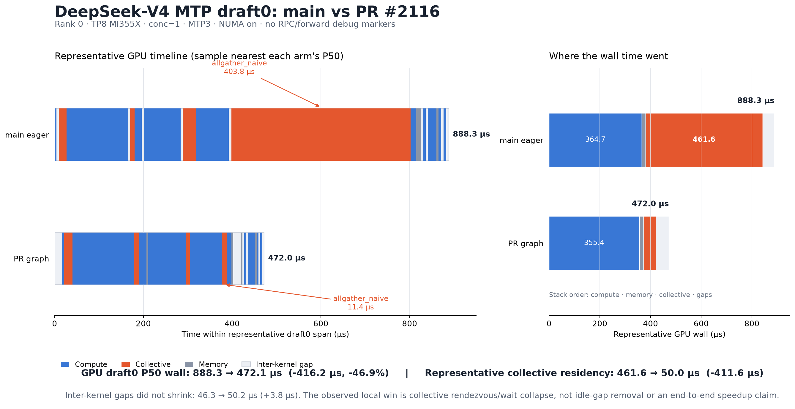

# DeepSeek-V4 MTP step-0 CUDA graph optimization

> Status: experimental, validated on DeepSeek-V4-Pro with MI355X TP8.
>
> This note records the motivation, implementation boundary, trace evidence,
> and current safety gates for the serial-MTP step-0 CUDA graph fast path.

## Summary

Before this change, `EagleProposer` captured serial-MTP steps `1..k-1`, but
ran step 0 eagerly. For DeepSeek-V4-Pro at concurrency 1 and `mtp_k=3`, step 0
contains three small `[4, 7168]` TP custom AllReduces plus the collectives in
`compute_draft_ids`. The arithmetic in the three AllReduces is short, but the
eager launch sequence lets TP ranks reach each rendezvous at different times.

The new fast path captures the DeepSeek-V4 step-0 backbone and draft-id
epilogue as one `DraftGraph`. Replay is confirmed on all eight ranks, while
prefill and unsupported layouts continue to use the eager fallback.

A fresh latest-main-versus-PR comparison, with NUMA binding enabled on both
arms and without RPC/forward debug markers, measured rank-0 step-0 GPU P50 at
`888.3 us` eager and `472.1 us` graphed: `-416.2 us` (`-46.9%`). The reduction
does not come from closing gaps between kernels. In representative samples,
collective residency fell from `461.6 us` to `50.0 us`, while internal kernel
gaps increased slightly from `46.3 us` to `50.2 us`. The graph makes TP ranks
reach the collective sequence together and collapses rendezvous/wait time.

This is operator-trace evidence, not an end-to-end throughput claim. A paired
long-duration workload is still required to determine how much of the local
`draft0` reduction reaches user-visible latency or throughput.

## Workload and measurement

The optimized and baseline traces used the following decode configuration:

| Item | Value |
|---|---|
| Model | DeepSeek-V4-Pro |
| Accelerator | 8 x AMD Instinct MI355X |
| Parallelism | TP8, DP=1, DCP=1, PCP=1 |
| Concurrency | 1 |
| Speculative method | serial MTP |
| Speculative tokens | 3 |
| Full verify width | 4 tokens per sequence |
| CUDA graph mode | `FULL` |
| Captured batch sizes | 1 and 2 |
| Draft graph switch | `ATOM_DRAFT_CUDAGRAPH=1` |
| NUMA placement | `ATOM_NUMA_BIND=1` |

The fresh baseline is `origin/main` commit `5adf642e`; the graph arm is PR
#2116 commit `ad09e455`, rebased by merging that main revision. In both arms,
steps 1 and 2 already replay complete backbone-plus-epilogue graphs. Only step
0 differs.

The controlled trace comparison uses the P50 duration of the rank-0
`propose_eagle[0/3 tok=4 ...]` GPU annotation. Both arms enable NUMA binding,
and neither contains the extra RPC/forward debug markers that perturb CPU
submission and overlap.

## Fresh PR A/B trace result

Each arm ran a 90-second AIPerf workload with an approximately 20-second
profiler window. Both completed with zero request errors.

| Rank-0 metric | Main eager | PR step-0 graph | Change |
|---|---:|---:|---:|
| Steady-state occurrences | `763` | `537` | - |
| Step-0 GPU annotation P50 | `888.291 us` | `472.087 us` | `-416.204 us` (`-46.9%`) |
| Step-0 CPU annotation P50 | `3195.856 us` | `495.062 us` | `-2700.794 us` (`-84.5%`) |
| Internal GPU kernel gaps P50 | `43.504 us` | `50.262 us` | `+6.758 us` |

The representative occurrence nearest each arm's P50 gives the causal split:

| Representative GPU time | Main eager | PR step-0 graph | Change |
|---|---:|---:|---:|
| Total wall | `888.291 us` | `471.967 us` | `-416.324 us` |
| Compute kernels | `364.749 us` | `355.433 us` | `-9.316 us` |
| Collective kernels | `461.562 us` | `49.996 us` | `-411.566 us` |
| Memory kernels | `15.637 us` | `16.356 us` | `+0.719 us` |
| Inter-kernel gaps | `46.344 us` | `50.182 us` | `+3.838 us` |



[Open the cropped rank-0 before/after trace directly in Perfetto](https://ui.perfetto.dev/#!/?url=https%3A%2F%2Fgist.githubusercontent.com%2Fyhl-amd%2F065c42a74e119e7ecc26f91f8e608178%2Fraw%2Fe433df97fda995f6768ea5e712ec626bafced84c%2Fpr2116-dsv4-draft0-main-vs-graph.perfetto-trace.json).
The crop contains aligned representative windows from both arms and no custom
RPC/forward debug markers.

The eager representative contains four collective kernels (`17.4`, `10.2`,
`30.2`, and `403.8 us`); the final long interval is `allgather_naive`. In the
graph representative, the four collectives are `18.6`, `11.0`, `9.0`, and
`11.4 us`. Compute time is nearly unchanged and kernel gaps do not shrink, so
the local improvement is collective rendezvous/wait collapse rather than
idle-gap removal.

Two older comparisons are superseded for this PR revision. One reported
`3.130 ms` eager versus `0.479 ms` graphed but included RPC/forward debug
instrumentation that changed CPU execution and overlap. A later earlier-revision
sample reported `461.9 us` versus `479.6 us`; it was collected before the
latest-main rebase and is not used for the current PR claim.

Every rank in the optimized trace reports:

```text
propose_eagle[0/3 tok=4 bs=1/1 graph]
```

The prefill in the same trace reports an eager label:

```text
propose_eagle[0/3 tok=92 bs=1]
```

This confirms both sides of the dispatch decision: the rectangular decode
path replays the recording, while the dynamic prefill path falls back to the
existing eager implementation.

## Why the graph path is still useful

Step 0 is the only serial-MTP pass that previously had no graph representation.
Capturing it establishes fixed staging, replay, and fallback behavior for the
full verification rectangle and, in the fresh trace, removes roughly `412 us`
of rank-0 collective residence from a representative step. Any end-to-end gain
still depends on whether this path is critical rather than overlapped with
other CPU/GPU work, so the follow-up comparison must use uninstrumented
long-duration request traffic.

## Implementation

### Per-pass token width

`DraftGraph` capture sizes are expressed in sequences, while forward context
and MoE communication sizes are expressed in token rows. A serial-MTP drafter
now declares the conversion on each pass through `tokens_per_seq`:

- DeepSeek-V4 step 0: `mtp_k + 1` rows per sequence;
- serial-MTP steps 1 and later: 1 row per sequence;
- DSpark block pass: its existing block draft width.

This avoids applying one drafter-wide width to passes with different shapes.

### Fixed step-0 inputs

The step-0 graph owns fixed-address staging buffers with these logical shapes:

| Input | Shape per captured batch | Dtype |
|---|---|---|
| Token IDs | `[batch, mtp_k + 1]` | `int32` |
| Positions | `[batch, mtp_k + 1]` | `int64` |
| mHC hidden states | `[batch, mtp_k + 1, hc_mult, hidden_size]` | model dtype |
| Last-token indices | `[batch]` | `int32` |

The forward flattens the first two axes and invokes the existing V4 MTP model.
The captured epilogue performs the dynamic `index_select` with staged
last-token indices and then calls `compute_draft_ids`.

Only the selected `[batch, hc_mult, hidden_size]` rows and draft IDs leave the
graph. The full `batch * (mtp_k + 1)` hidden tensor stays in graph-owned
storage, avoiding an unnecessary full-output copy after replay.

### Attention metadata

DeepSeek-V4's target CUDA-graph capture builder already synthesizes the exact
full-width decode rectangle needed by step 0. Its attention metadata points to
persistent `forward_vars` buffers, and runtime decode refills the same
addresses. Step-0 warmup therefore reuses this target-built decode context and
sets the pass token count to `batch * (mtp_k + 1)`.

The post-step-0 rewrite to one-row-per-sequence metadata remains outside this
graph. Steps 1 and later continue to use the existing mid-step graph.

## Runtime safety gates

The step-0 graph is declared only when all of the following are true:

- the draft model is `DeepseekV4MTP`;
- DP, DCP, and PCP sizes are all 1;
- expert parallelism and TBO are disabled;
- MRoPE is disabled;
- MTP index sharing is disabled;
- the V4 configuration exposes `hc_mult`.

Even when a recording exists, a serving step replays it only when all runtime
conditions match:

- the step is decode, not prefill;
- `scheduled_bs == running_bs`;
- the token stream is exactly `batch * (mtp_k + 1)` rows;
- `attn_metadata.max_seqlen_q == mtp_k + 1`;
- token IDs, positions, hidden states, and last-token indices have the captured
  dtype, rank, and contiguous layout;
- a recording exists for the exact batch size.

Any mismatch takes the pre-existing eager path. There is no runtime capture.

## Validation

The implementation passed:

- Python bytecode compilation for all modified modules;
- `tests/test_draft_graph.py` and `tests/test_dspark.py`: 92 tests passed;
- TP8 startup capture for batch sizes 1 and 2;
- 11/11 warmup requests and 8/8 profiled requests with zero request errors;
- 537 steady rank-0 graph occurrences in the fresh profiler window;
- paired 90-second AIPerf runs with zero request errors;
- server-log checks for GPU faults, illegal accesses, assertions, and
  tracebacks.

The short integration run used forced speculative acceptance length `2.49`,
so it validates execution, shapes, token counts, and collective ordering. It
does not replace a non-forced semantic-output comparison.

The extra startup work was small in this configuration: draft-pass warmup
increased from `0.39 s` to `0.50 s`, and the logged CUDA graph pool allocation
did not show a measurable increase at GiB precision.

## Reproduction outline

Start ATOM from this branch with the fixed TP8 configuration:

```bash
ATOM_DRAFT_CUDAGRAPH=1 \
ATOM_NUMA_BIND=1 \
python3 -u -m atom.entrypoints.openai_server \
  --model /models/DeepSeek-V4-Pro \
  --served-model-name deepseek-ai/DeepSeek-V4-Pro \
  --tensor-parallel-size 8 \
  --kv-cache-dtype fp8 \
  --index-cache-dtype fp4 \
  --enable-prefix-caching \
  --gpu-memory-utilization 0.9 \
  --max-num-batched-tokens 16384 \
  --attn-prefill-chunk-size 16384 \
  --state-checkpoint-interval-tokens 8192 \
  --level 3 \
  --cudagraph-mode FULL \
  --method mtp \
  --num-speculative-tokens 3 \
  --spec-decode-acceptance-length 2.49 \
  --max-num-seqs 2 \
  --torch-profiler-dir /profiles
```

Capture a steady-state window through the profiling endpoints:

```bash
curl -X POST http://127.0.0.1:8000/start_profile
# Run steady decode traffic for approximately 20 seconds.
curl -X POST http://127.0.0.1:8000/stop_profile
```

Check every rank trace for the exact step-0 graph label and align collective
kernels by launch order. For captured custom AllReduce kernels, Kineto omits
the launch grid, while the baseline eager step-0 calls expose grid x = 56.

## Remaining work

1. Run a paired 900-second end-to-end A/B with the same request trajectory and
   compare ITL, output throughput, and acceptance; the current result is a
   local operator-trace improvement, not an end-to-end gain measurement.
2. Run without forced acceptance and compare generated token IDs against the
   eager path.
3. Add and validate DP, DCP, PCP, EP, and TBO support before relaxing the
   declaration gates.
4. Continue with the independent target-side bottleneck: 123 TP AllReduces per
   target graph. This change intentionally does not alter that protocol.
