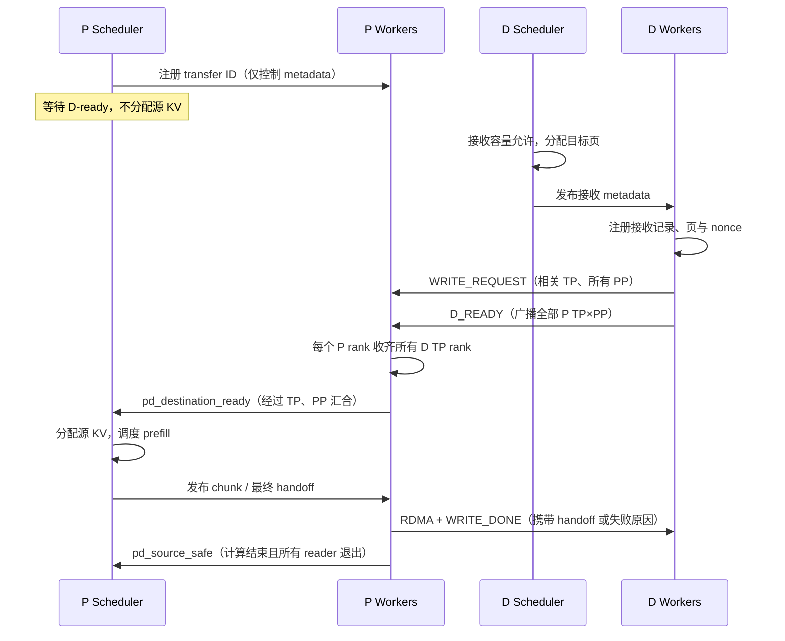

# Chunked PD 故障分析与 D-ready 准入设计

## 实验与证据

2026-09-30，CPP4（PP4 × TP1）prefill、TP4/DCP4 decode，开启 Mooncake chunked transfer 与 P 端 LMCache offload。日志位于 `/mnt/raid0/mengqing/logs`。56 是 session-tree 并发，实际 HTTP in-flight 峰值为 79。

- 01:32:59，P 请求 0 开始首个 chunk；下一次调度为 01:35:56，间隔 177 秒。日志不能确认这段耗时的具体组成。
- 01:34:00，D 首批 49 个请求接收失败；此前 KV 使用率 98.3%，Running=0。原实现等待 P allocation/ready 超过 60 秒直接通知失败，不打印异常栈。
- 全程 314 个到达请求中，209 个 D 请求发生 KV receive failure。P 的 163 条异常栈对应 16 个 transfer ID，其中 chunk wait 66 条、handoff wait 97 条。
- 请求 230：02:16:39 到达；P 命中 437712 / 439262 tokens，当秒完成；D 02:35:34 收到 KV failure，02:46:39 被取消，记录 `returned without running: aborted`。
- D 的失败回退存在优先级重排：消费失败通知后变成 WAITING；若本轮余量不足，下轮仍带失败通知的 remote waiters 会被提升到它前面。实际 02:36:16 的 batch 使用 14260+2112 tokens，仅余 12，不足 64-token 对齐；CPU 调用实际调度方法复现了 230 被 231 等请求超越。
- router 请求 02:16:38 开始，AIPerf 02:46:38 报 ClientPayloadError，恰好约 1800 秒，匹配默认 HTTP 总超时，随后取消 D 请求 230。高置信度判断最终断流由 router timeout 触发；日志未直接输出底层 timeout 异常。
- ATOM 流路径传入 decode_url=None，流错误日志受该字段保护，因而漏记最终错误。AIPerf 因 warmup_failure 退出，profiling 未开始。

### 根因链条与证据边界

旧协议中，P 是否开始 prefill 与 D 是否拿到接收页是两个独立决策。P 可以先算完并启动源保留计时，而 D 仍在排队；也可能 D 已分配大量目标页，但 P 尚未计算出首块。旧的 60 秒等待同时覆盖不同阶段，一旦失败，D 退回本地 prefill，挤占调度预算，进一步推迟后续接收。最终长尾请求触发 router 总超时，流中断使 AIPerf warmup 整体失败。

本次先打断“没有 D 接收容量的请求也能占用 P 计算/KV”的环节。它不能单独消除 D fallback 队列重排，也不能提供 decode 后续生成的显存预留。

| 证据 | 位置 |
| --- | --- |
| 首块之后长时间无下一次调度 | `logs/prefill-rank-0.log:2265`、`:3035` |
| 第一批 D 接收失败 | `logs/decode-rank-0.log:11610` |
| 230 的 P prefill 与 D 排队 | `logs/prefill-rank-0.log:23729`、`logs/decode-rank-0.log:63499` |
| 230 失败回退、最终取消 | `logs/decode-rank-0.log:91922`、`:97247`、`:97258` |
| 对应 HTTP 请求起点 | `logs/router.log:723`，request ID `2b8f22dc-6641-49f5-9a7e-6f491f713267` |
| 客户端断流及 warmup 终止 | `logs/api_perf.log:396`～`:398` |

上表 `logs/` 相对 `/mnt/raid0/mengqing`。不能从现有日志把 177 秒间隔归因于某个具体 kernel 或 compilation；router timeout 是时间线与默认配置共同支持的高置信度推断，新增流日志用于在复测中直接验证它。

## SGLang 对照

核对本地 `sglang` 提交 c311bc961164be098bb281b743fdbb59ad35b1ba 和 `sglang_pd_kv_transfer_analysis_zh.md`（文档基于较早的 56fee88e23）。

对应实现入口为 `python/sglang/srt/disaggregation/decode.py::pop_preallocated`、`prefill.py::pop_bootstrapped` / `send_kv_chunk` 和 `mooncake/conn.py` 的发送队列、bootstrap/receive 轮询。参考源码位于 `/mnt/raid0/mengqing/sglang`。

SGLang 默认先由 D 分配目标 KV 并发送 metadata；P 在 bootstrap 完成后才进入计算 waiting queue。D admission 包括 decode token 预留。发送队列的单位是已就绪 chunk。正常完成后 P 等传输终态才释放源引用。bootstrap 与接收等待默认各 300 秒；普通传输失败明确 abort，不在 D 自动重算。过载仍可能失败，这些机制不能替代容量规划。

## 本次实现范围

实现 D-ready 控制握手、P allocation/compute 前准入，以及 admission / compute / transfer 分阶段超时和日志；修复 router 流错误漏记。保持实际数据传输布局、请求级发送任务、既有 D fallback 策略。发送线程改为逐 chunk 任务、D decode 容量预留、fallback 公平性另行实现。

### 握手与安全条件

1. P scheduler 在 allocation、prefix/offload 查询之前注册 `(P request ID, transfer ID)`，仅传控制 metadata 给所有 P workers。等待期间不持有 P 的 KV allocation，也不占发送线程。无 forward 的 idle tick 仍派发 metadata、轮询完成。
2. D 的每个 worker 在分配好目的页和接收状态、向所有相关 P stages 发布 WRITE_REQUEST 后，向所有 P TP×PP workers 发送 D_READY。消息包含 transfer ID、D worker rank/endpoint、nonce、consumer TP size、prompt digest。
3. 每个 P worker 按 D rank 去重收齐 consumer TP quorum，校验一致性后报告 `pd_destination_ready`。scheduler 使用现有 TP、PP completion quorum，全部 P workers 成功才准入。D_READY 可先于 P HTTP 请求/注册到达；状态按 transfer ID 关联。
4. 只有已准入请求才能调用 block_manager allocation 和模型 forward。部分 rank 到达、重复消息、已取消 transfer 都不能误开放准入。
5. 取消/过期保留有界 tombstone，晚到控制消息不能复活请求。未开始传输的 WRITE_REQUEST 可以直接返回失败；已有 reader/RDMA 仍由原 reader 发终态，禁止提前通知 D 重用目标页。
6. 正常源释放继续依赖 reader 全部退出及 P 最终完成；任何超时都不表示底层同步 RDMA 已停止。



### 超时配置与语义

Mooncake 子配置使用正数秒配置：`admission_timeout_s`、`compute_timeout_s`、`transfer_timeout_s`，chunked 模式默认各 300 秒。旧非 chunked lookup 保持现有行为。

| 阶段 | 计时起点 | 进展/终点 | 失败与安全约束 |
| --- | --- | --- | --- |
| admission_wait | P 注册准入；D scheduler 首次等待目的分配 | D-ready 全 rank 收齐；D 分配成功 | P 不再准入，通知尚未发送的消费者；D 尚未发布目的页时可本地取消 |
| compute_wait | D-ready 后等待 P allocation/首块；每次等待下一可发送块/最终 handoff | 当前所等的块或 handoff 可用 | 返回具体等待类型与页游标；不把 RDMA 排队计入 chunk 计算等待 |
| transfer_wait | 已完成 prefill 后等待 reader 排空；实际 GPU event/RDMA 等待记录耗时 | reader/RDMA 完成 | 标记过期并记录原因；同步 RDMA 不可强制中断，必须继续 drain 后才释放 |
| cancel | 用户断开、准入失败、阶段超时或协议错误 | 已有所有写入退出 | 保留首个原因，跨 P/D 传递 reason，区分取消与超时 |

日志以 `[PD]` 标记，包含 role、P/D request ID（可用时）、transfer ID、PP/TP rank、phase、event、elapsed_s、reason；阶段开始/结束 INFO，超时/失败 WARNING 或 ERROR，逐 chunk 细节 DEBUG，避免每个 idle tick 刷日志。D 收到失败保留原因；router 无条件记录流异常和上游地址。

### 兼容性和限制

P/D 应一起升级；新的 chunked producer 要求 D-ready。bootstrap capability 公布协议版本。保留 `pd_source_safe` 与现有跨 rank 完成屏障。旧非 chunked 路径不启用该门控。

超时是协议等待期限，不是 GPU/NIC 强制抢占。节点死亡或同步 RDMA 永久挂住时仍可能需要外层 watchdog；不能为缩短等待而提前回收在写的内存。300 秒不能保证任意长请求/并发都成功。

## 验证计划

- 真正 Scheduler：未 ready 不分配不 forward；后到但 ready 请求可越过未 ready 请求；idle metadata 有工作标志；全 quorum 后恢复正常 chunk prefill。
- 消息顺序：D-ready 先于 P 注册、部分/重复 rank、TP×PP quorum、取消后晚到消息、失败原因传递。
- 时钟控制：三个独立 timeout 配置校验与到期边界；取消/超时诊断；活动 reader 未退出时不释放源或目标。
- 回归 chunked transfer、PP/TP 聚合、源 claim、D failure fallback、MultiConnector 与 metadata work detection。
- 检查 router 流错误日志；本地 CPU 测试通过不代表已完成 GPU/RDMA 56 并发复测。

## 实现与验证记录

### 已实现的代码路径

- `atom/model_engine/scheduler.py`：入队注册、遍历等待请求时进行准入判断；门控在缓存查询和 block allocation 之前。未 ready 的请求移到本轮 skipped 队列，其他 ready 请求继续调度；静态不可调度请求立即清理准入状态。超时扫描覆盖所有等待项。
- `atom/kv_transfer/disaggregation/pd_admission.py`：独立 timeout 配置校验、D-ready quorum、nonce/endpoint/摘要一致性与超时判断。
- `atom/kv_transfer/disaggregation/mooncake/mooncake_connector.py`：控制 metadata、ready 广播、跨 TP/PP completion、阶段日志、WRITE_DONE 失败原因。实际 WRITE_REQUEST 必须对应 D-ready 的接收身份。无直接消费者的 P TP rank 仍参与 ready/quorum，最终无需等待不存在的 reader。
- `atom/kv_transfer/disaggregation/chunked_prefill.py`：计算等待与最终传输 drain 分离；最终 handoff 的首次时间固定，重复 handoff 不延长期限；保存首个取消原因。worker 计算/传输超时只停止新传输，源释放还要求 scheduler 发布计算终态和 reader 全部退出。
- `types.py`、`base.py`、`multi/multi_connector.py`：控制消息可通过 MultiConnector 和 idle metadata 路径，不依赖模型 forward。
- `atom/entrypoints/openai/api_server.py`：发现信息携带 `d_ready_protocol: 1`。这是 capability 声明，未实现混合版本自动协商，P/D 需要一起升级。
- `atom/mesh/src/routers/http_pd_router.rs`：ATOM 流路径带上 decode URL，所有流错误均记录，Debug 格式保留 reqwest 错误链。

未新增独立 D receive 强制回收计时器。D 发布目标地址以后，仍等待所有相关 P stage/rank 的终态才允许沿用原有失败处理；P 超时不会让 D 在远端 RDMA 未退出时重用目标页。用户取消沿用已有 abort/drain 路径；上游没有传入更细原因时，日志明确写 `request aborted by scheduler/client`，不会把它推断成某个具体超时。

`transfer_timeout_s` 限定最终 handoff 之后等待发送任务完成的时间，包括仍未执行的 reader；逐块 GPU event/RDMA 耗时单独计入日志中的 `transfer_wait_s`，发送线程池排队记录为 `queue_wait_s`。这不是可抢占的 NIC 调用超时。`compute_timeout_s` 分别用于 ready 后等待首块、每次等待下一块与最终 handoff，不是整个长 prompt 的总计算时间上限。

### 配置与复测观察点

在 P/D 的 Mooncake 子配置中设置下面三项；P 使用 `multi` 时放到其中的 Mooncake 项，而不是 MultiConnector 顶层。省略时各为 300 秒，必须是有限正数。

```json
{
  "kv_connector": "mooncake",
  "kv_role": "kv_producer",
  "enable_chunked_transfer": true,
  "admission_timeout_s": 300,
  "compute_timeout_s": 300,
  "transfer_timeout_s": 300
}
```

D 使用 `kv_role: "kv_consumer"`，并保留实际环境中既有的网络和拓扑字段。应用改动需要重启 P/D，router 流日志修复需要重新构建并重启 router。

复测时按 `transfer_id` 串联 `admission_wait/start` → `d_ready_sent` → `quorum_complete` → `compute_wait/allocated` → `first_chunk_published` → `handoff_ready` → `receive_complete`。失败日志包含阶段、elapsed/limit、页游标或 ready rank 数量；D 的 `write_failed` 保留 P 原始原因。逐块等待与 GPU/RDMA 起点为 DEBUG 日志。INFO 层的发送完成同时记录计算等待、传输等待和发送排队耗时，D 的接收总耗时包含远端计算。

### 验证结果

在已有开发容器 `atom_cmq_1_44_pd_dev_0927` 中运行真实 Python Scheduler、connector、TP/PP aggregator。测试以 CPU buffer 和模拟 NIC/GPU event 驱动真实传输地址规划，没有运行模型或 GPU benchmark。

```bash
docker exec -w /mnt/raid0/mengqing/ATOM atom_cmq_1_44_pd_dev_0927 \
  python -m pytest -q -rs \
  tests/test_pd_admission.py tests/test_pd_chunked_transfer.py \
  tests/test_pd_source_claim.py tests/test_pd_recv_failure.py \
  tests/test_pd_pp.py tests/test_pd_producer_config.py \
  tests/test_kv_aggregator.py tests/test_multi_connector.py \
  tests/test_scheduler.py tests/test_prefill_scheduler.py \
  tests/test_scheduler_partial_prefill_tail.py tests/test_kv_connector_scheduler.py \
  tests/test_pp_kv_status.py tests/entrypoints/test_pd_prompt_token_ids.py
```

结果：**555 passed，1 skipped**。跳过的是仓库既有的 `test_kv_connector_scheduler.py`：该文件仍引用拆分前的 `kv_transfer_engine` 路径，带有模块级 skip。覆盖未 ready 不分配/不 forward、后来的 ready 请求越过未 ready 队首、控制消息 idle/PP/Multi 转发、TP×PP 全 quorum、ready 提前/重复/冲突/晚到、取消后不复活、独立超时、失败原因上线路、活跃 reader 与未完成计算禁止提前释放、无消费者 rank 的源释放。

主要 Python 改动模块通过 Black 与 Ruff；`git diff --check` 通过。Router 文件通过 `rustfmt --emit stdout` 语法解析；完整 `cargo test --offline --lib routers::http_pd_router::tests` 未完成，宿主机缺少 OpenSSL 开发库，容器离线依赖索引也缺少锁定版本的 `hyper-util 0.1.21`。未修改依赖锁文件以绕过环境限制。

尚未进行实际 GPU/RDMA 56 并发复测。这次测试确认协议与调度约束，不证明该并发、prompt 长度下的最终吞吐、容量或成功率。
